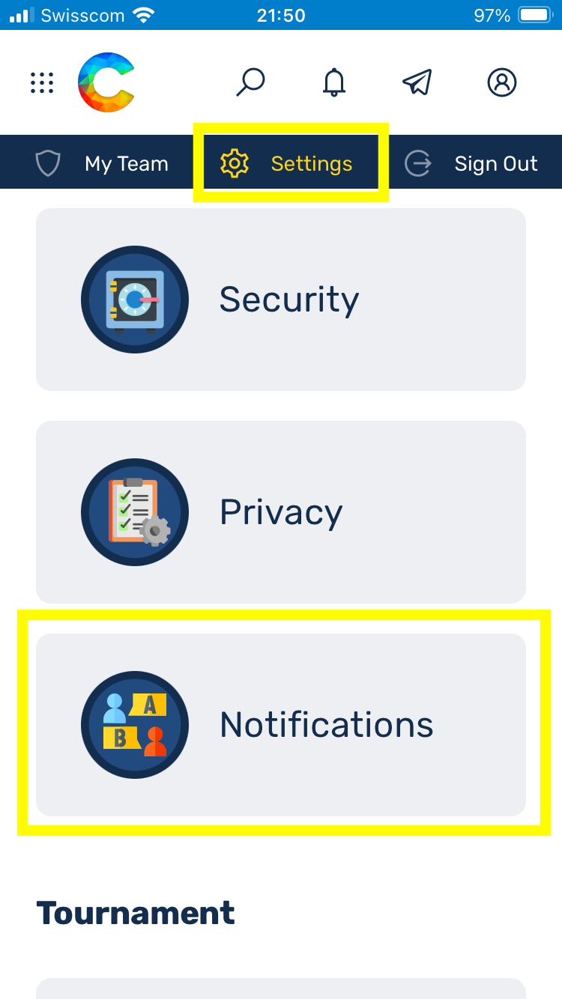
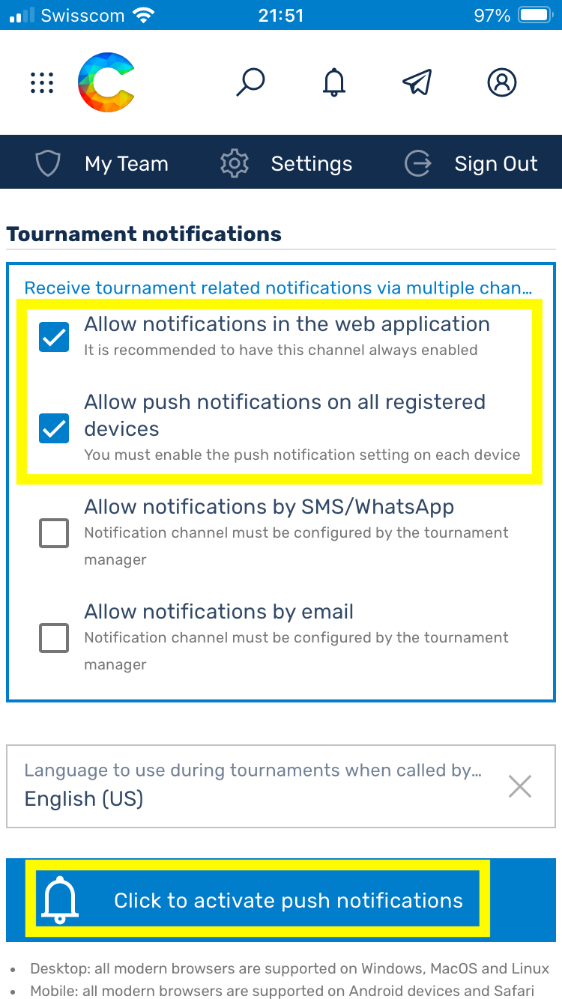
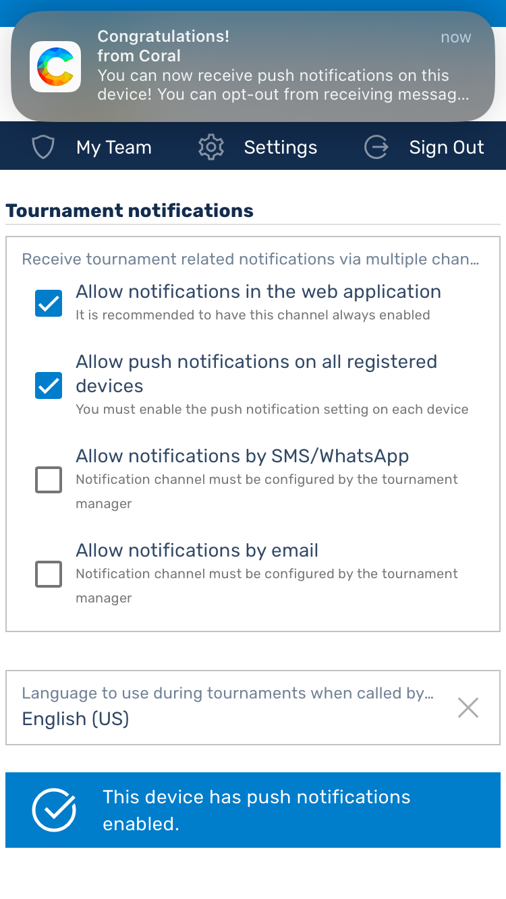
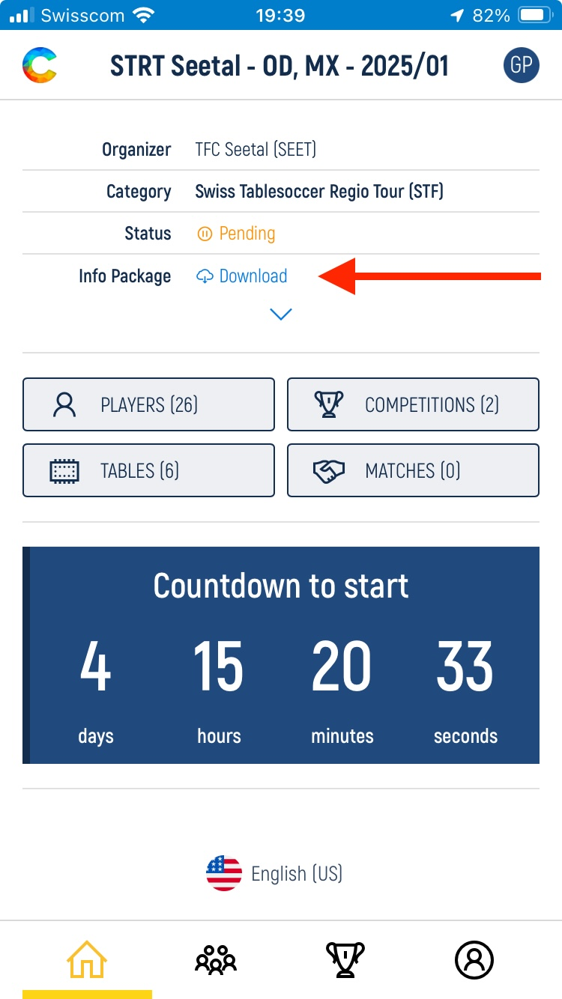

# Swiss Tablesoccer Federation (STF) goes Coral

Liebe Tischfussball-Community,

die STF freut sich verkünden zu dürfen, dass mit der Saison 2025 endlich der Wechsel auf die neue Turnier Software *[Coral - https://app.tablesoccer.org](https://app.tablesoccer.org)* erfolgen wird. Die Software wird mittelfristig wensentliche administrative und organisatorische Erleichterungen bringen, welche signifikante Einsparungen bei personellen Ressourcen ermöglichen. Das bedeutet das absofort (Januar 2025) alle Turniere mit Coral abgewickelt werden. Dies bringt vorerst nachfolgende Änderungen mitsich:

- Turniere werden ab sofort auf [Coral](https://app.tablesoccer.org) ausgeschrieben. (Ist ein Turnier noch nicht drauf? Bitte habe noch etwas Geduld, wir arbeiten daran!)
- __Anmeldung für Turniere erfolgt absofort über [Coral](https://app.tablesoccer.org)__ und nicht mehr wie bisher über [https://register.swisstablesoccer.ch](https://register.swisstablesoccer.ch). Das bisherige Registrierungs-Tool wurde dekomissioniert und durch einen Onepager ersetzt.
- Resultate können ab sofort auf dem Handy von den Spielenden selbst eingegeben werden. Dies entlastet die Turnierleitung und erlaubt zügiges aufrufen wartender Spiele.
- Die Ranglisten der Saison 2025 werden auf Coral geführt. Bereits ausgetragenen Turniere im 2024, welche bereits zur Saison 2025 zählen, werden in den kommenden 1-2 Monate in Coral importiert sein.
- __An den Turnieren wird das Recall-Protokoll eingeführt__. Dies erlaubt uns sicherzustellen, dass Spiele schneller aufgenommen und empfindliche Verzögerungen im Zeitplan vermieden werden können. Dadurch wird das Spielerlebnis aller Turnierteilnehmenden erheblich verbessert, vermeidet frustration und erlaubt uns hoffentlich den Modus in Zukunft zu Gunsten der Spielenden anzupassen. Das Recall-Protokoll wird am STS in Luzern zum ersten Mal getestet werden.

Die STF arbeitet daran den Informationsfluss und -gehalt zur Coral-Einführung zu verbessern. Ebenfalls sind wir dabei, nach und nach Personen zu Berechtigen, Vereine und Turniere zu verwalten. Bei Frage wendet euch bitte wie gewohnt an [sport@swisstablesoccer.ch](mailto:sport@swisstablesoccer.ch).

## Inhaltsverzeichnis

- [Inhaltsverzeichnis](https://register.swisstablesoccer.ch/#inhaltsverzeichnis)
- [Coral Accounts](https://register.swisstablesoccer.ch/#coral-accounts)
- [Anmelden für Turniere](https://register.swisstablesoccer.ch/#anmelden-f%C3%BCr-turniere)
- [Einem Club beitreten](https://register.swisstablesoccer.ch/#einem-club-beitreten)
- [Während eines Turniers](https://register.swisstablesoccer.ch/#w%C3%A4hrend-eines-turniers)
- [Ein Turnier aufschalten](https://register.swisstablesoccer.ch/tournaments)
- [Häufig gestellte Fragen (FAQ)](https://register.swisstablesoccer.ch/#faq)
    * [\#1 Ich kann mich nicht für Competitions registrieren. Die einzelnen Disziplinen sind ausgegraut](https://register.swisstablesoccer.ch/#1-ich-kann-mich-nicht-f%C3%BCr-competitions-registrieren-die-einzelnen-disziplinen-sind-ausgegraut)
    * [\#1.1 Ich kann bei der Registrierung meine/n Spielpartner/in nicht auswählen.](https://register.swisstablesoccer.ch/#11-ich-kann-bei-der-registrierung-meinen-spielpartnerin-nicht-ausw%C3%A4hlen)
    * [\#2 Coral zeigt nach dem Login auf dem PC nur eine weisse Oberfläche an](https://register.swisstablesoccer.ch/#2-coral-zeigt-nach-dem-login-auf-dem-pc-nur-eine-weisse-oberfl%C3%A4che-an)
    * [\#3.1 Wie kann ich Coral als Web-App installieren?](https://register.swisstablesoccer.ch/#31-wie-kann-ich-coral-als-web-app-installieren)
    * [\#3.2 Push-Benachrichtigungen funktionieren nicht auf meinem Handy](https://register.swisstablesoccer.ch/#32-push-benachrichtigungen-funktionieren-nicht-auf-meinem-handy)
    * [\#4 die Tabelle zeigt mir das Buchholz nicht an](https://register.swisstablesoccer.ch/#4-die-tabelle-zeigt-mir-das-buchholz-nicht-an)
    * [\#5 Ich habe mich angemeldet aber mein Status ist noch auf *pending*. Warum?](https://register.swisstablesoccer.ch/#5-ich-habe-mich-angemeldet-aber-mein-status-ist-noch-auf-pending-warum)
    * [\#6 Wie sind die Gebühren, welche mir angezeigt werden zu verstehen?](https://register.swisstablesoccer.ch/#6-wie-sind-die-geb%C3%BChren-welche-mir-angezeigt-werden-zu-verstehen)
    * [\#7 Wo finde ich neu die Turnierausschreibung?](https://register.swisstablesoccer.ch/#7-wo-finde-ich-neu-die-turnierausschreibung)
    * [\#8 WLAN an Turniere](https://register.swisstablesoccer.ch/#8-wlan-an-turniere)
    * [\#9 Welche Lizenztypen gibt es in Coral und wie bilden sie sich auf die bekannten STF Strukturen ab?](https://register.swisstablesoccer.ch/#10-ich-erf%C3%BClle-die-anforderungen-f%C3%BCr-itsf-turniere-nicht)
    * [\#10 Ich erfülle die Anforderungen für ITSF-Turniere nicht](https://register.swisstablesoccer.ch/#10-ich-erf%C3%BClle-die-anforderungen-f%C3%BCr-itsf-turniere-nicht)

## Coral Accounts

Hast Du bereits einmal an einem ITSF-Turnier (die meisten Turniere der Swiss Tablesoccer Series (STS) sind auch ITSF-Turniere) mitgespielt, dann bist Du bereits in Coral registriert. In diesem Fall kannst Du den bereits für Dich erstellten Account übernehmen. Dieser ist automatisch auch bereits mit Deiner ITSF-Nummer verknüpft. Klicke hierfür auf [Account Take Over](https://app.tablesoccer.org/take-over) und folge den Anweisungen. Nachfolgend verlinktes Youtube-Video führt Dich durch die einzelnen Schritte, solltest Du dabei Hilfe benötigen.

- [Account Take Over](https://app.tablesoccer.org/take-over)
- [Tutorial](https://www.youtube.com/watch?v=9JbgURqE2IE)

Falls Du mit Sicherheit zum ersten Mal an einem ITSF-Turnier teilnimmst, musst Du einen neuen [Account eröffnen](https://app.tablesoccer.org/register). Bitte überprüfe dabei, ob Du Deinen Namen wirklich nicht in der Liste bereits registrierter Liste findest und bestätige, dass Du nicht auf der Liste bist.

- [⁠Neuen Account Erstellen](https://app.tablesoccer.org/register)

## Anmelden für Turniere

Um Dich für Turniere anmelden zu können, musst Dein Status erst auf *Active* sein. Falls Dein Status auf *inactive* ist (siehe nachfolgende Bildschirmfotos), musst Du diesen erst aktivieren. Klicke hierfür auf *renew*, falls Du bereits Mitglied eines Clubs bist oder trete einfach Deinem Verein bei indem Du auf *Join Club* klickst (Siehe hierzu [Einem Club beitreten](https://register.swisstablesoccer.ch/#einem-club-beitreten)). Wähle in beiden Fällen die passende [Mitgliedschaft](#) aus.

- *TODO Mitgliedschaft/Lizenzen*

{: width="320px" }
{: width="320px" }

## ⁠Einem Club beitreten

Um einem Club beitreten zu können kannst Du unter Deinem *Profile > Join Club* auswählen. Danach im Suchfeld nach Deinem Verein suchen, die passende Mitgliedschaft auswählen und erforderliche Informationen ausfüllen. Wähle die Mitgliedschaft gemäss [Lizenztypen ab 2026](https://license.swisstablesoccer.ch/#lizenztypen-ab-2026).

{: width="320px" }

## ⁠Während eines Turniers
- Resultat Eingabe
- ⁠Recalls

## ⁠FAQ

### \#1 Ich kann mich nicht für Competitions registrieren. Die einzelnen Disziplinen sind ausgegraut
- Player Status entspricht nicht den Anforderungen. -> Membership STF (National oder Club) auf Active oder Club beitreten und Membership "Club" wählen
- Alter erlaubt die Teilnahme an Senioren-Disziplinen nicht -> Edit Profil Information, dort Alter korrigieren

### \#1.1 Ich kann bei der Registrierung meine/n Spielpartner/in nicht auswählen.
Zur Teilnahme an der Swiss Tablesoccer Series (STS) sind nur Spielende mit Status *Active* zugelassen. Dein/e Spielpartner/in ist höchstwahrscheinlich noch nicht auf *Active*. Bitte sie/ihn darum, einem Verein beizutreten oder die bestehende Mitgliedschaft zu erneuern.

### \#2 Coral zeigt nach dem Login auf dem PC nur eine weisse Oberfläche an
Falls bei einem Benutzer auf dem PC nach dem Login in Coral nur eine weisse Seite angezeigt werden sollte, dann könnte dies damit zu tun haben, das seine Zeiteinstellung nicht in Ordnung ist. Sprich seine Zeit auf dem PC ist nicht synchronisiert (z.B. 3 Minuten hinter der effektiven Zeit).
Dies kann passieren, wenn man die automatische Zeitsynchronisation in Windows deaktiviert hat. Um das zu beheben, geht in die Zeiteinstellungen von Windows und aktiviert das automatische setzen der Zeit sowie der zeitzone:

{: width="960px" } 

### \#3.1 Wie kann ich Coral als Web-App installieren?

{: width="240px" }
{: width="240px" }
{: width="240px" }
{: width="240px" }

### \#3.2 Push-Benachrichtigungen funktionieren nicht auf meinem Handy
Um Push-Benachrichtigungen aktivieren zu können, muss Coral (app.tablesoccer.org) erst dem Home-Bildschirm hinzugefügt werden (Installation als Web-App). Siehe _FAQ #3.1_

Push-Benachrichtigungen müssen dann zweistufig aktiviert werden. Erst unter *Profile > Settings > Notification*. 

{: width="320px" }
{: width="320px" }
{: width="320px" }

Dann unterm Turnier selbst. Die Einstellung im Profil ist notwendig, damit Android oder iPhone die Push-Benachrichtigungen auf System-Level aktivieren.
Einmal aktiviert, werden die Einstellungen im Profil als Standard für zukünftige Turniere genommen. Es muss also nicht jedes Mal neu aktiviert werden.

### \#4 die Tabelle zeigt mir das Buchholz nicht an
- Auf Mobilegeräte wird Hochformat die Tabelle verkürzt dargestellt: Teamname, Platzierung, Punkte
- Im Querformat wird die Tabelle vollständig angezeigt. B steht für Buchholz, SB für Small Buchholz resp. Feinbuchholz

{: height="400px"}
{: height="400px"}

### \#5 Ich habe mich angemeldet aber mein Status ist noch auf *pending*. Warum?

*Pending* ist korrekt, wir werden dann am Tag des Turniers alle auf *Confirmed* setzen, sobald wir die Anwesenheitskontrolle gemacht haben. So können wir einfacher vor Ort noch Anpassungen vornehmen, falls Spielende nicht erscheinen oder kurzfristig absagen. 

### \#6 Wie sind die Gebühren, welche mir angezeigt werden zu verstehen?

Die Gebühren kannst Du vorerst noch ignorieren, dass ist erst testweise eingestellt. Es ist gut möglich, dass diese aktuell noch von der Realität abweichen. Falls Du vorauszahlen möchtest, kannst Du Dich gemäss üblichen Gebühren wie folgt orientieren:

- Stärkeklasse gemäss [STF-Homepage](https://swisstablesoccer.ch/media/attachments/2024/01/16/starkeklassen-2024.pdf) ermitteln. 
    * *__Achtung!__ Die Stärkeklasse ist in Coral noch nicht bei allen Spielenden korrekt eingestellt und ist somit nicht verbindlich*
- OD, OS, WD, WS -> CHF 20 (CHF 10 falls Rookie)
- MX, RD -> CHF 10
- CHF 15 für Tageslizenz, falls keine Jahreslizenz 

Bitte folge zudem den Anweisungen zur Vorauszahlung gemäss der [Ausschreibung](https://register.swisstablesoccer.ch/#7-wo-finde-ich-neu-die-turnierausschreibung). Diese ist neu auch in Coral zu finden.

### \#7 Wo finde ich neu die Turnierausschreibung?

Die Ausschreibung findest Du nun auch in Coral. Auf der Startseite jedes einzelnen Turniers gibt es einen Download-Link, wo Du Dir das altbekannte PDF herunterladen und anschauen kannst.

{: width="320px" }

### \#8 WLAN an Turniere

Das Streaming-Team der STF stellt an Turnieren der Swiss Tablesoccer Series (STS) gratis WLAN zur Verfügung, durch welches sich auch bei schlechtem Empfang in der Halle die Interaktion mit Coral ausreichend angenehm gestaltet. Die Zugangsdaten sind wie folgt:

| Bezeichnung | Wert |
|:---|:---|
| SSID 2.4 Ghz | STFTurnier |
| Passwort | STFTurnier! |

_**Disclaimer:** Es besteht kein Anspruch auf Verfügbarkeit des Services. Es kann aufgrund personellen Engpässen zu Ausnahmen kommen._

### \#9 Welche Lizenztypen gibt es in Coral und wie bilden sie sich auf die bekannten STF Strukturen ab?

|Membership | Level | Beschreibung | Berechtigt für | Kosten |
|:---|:---|:---|:---|:---|
| __International - ITSF & STF__ | International | Alle mit gültiger ITSF & STF Jahreslizenz | ITSF 250/500/750/1000, STS, STRT, CH-Meisterschaft | CHF 50 + Clubmitgliedschaft
| __National - STF__ (theoretisch) | National | Alle mit gültiger STF Lizenz ohne ITSF Lizenz | STS ohne ITSF Status, STRT, CH-Meisterschaft | CHF 40 + Clubmitgliedschaft |
| __Club - STF__ | National | Alle mit Clubmitgliedschaft, ohne ITSF & STF Lizenz | STS ohne ITSF Status, STRT | Clubmitgliedschaft |
| __Guest - STF__ | National | Alle übrigen (Weder ITSF, STF noch Clubmitgliedschaft) | STS ohne ITSF Status, STRT | Keine |
| __Club - ITSF__ | International | Alle mit Clubmitgliedschaft & ITSF Lizenz, ohne STF Lizenz | ITSF 250/500/750/1000, STS, STRT | CHF 10 + Clubmitgliedschaft | 
| __Guest - ITSF__ | International | ITSF Lizenz, ohne STF Lizenz und Clubmitgliedschaft | ITSF 250/500/750/1000, STS, STRT | CHF 10 + Admingebühr | 

_**Disclaimer:** Diese Auflistung dient aktuell, um eine brauchbare Datenhaltung in Coral zu schaffen. Wie genau die Lizenzierung für 2026 aussehen wird, muss und wird noch diskutiert werden. Ebenfalls gerade im Zusammenhang mit dem Schiedsrichterwesen kann und wird es wohl noch Anpassungen geben._

### \#10 Ich erfülle die Anforderungen für ITSF-Turniere nicht

Um an einem ITSF Turnier, früher Pro  (250, 500, 750 & 1000)Tour, Master Series, World Series, ist eine ITSF-Lizenz erforderlich. Diese ist in der STF-Jahreslizenz inkludiert. Spielende ohne STF-Jahreslizenz können über ihren Club entweder _Club - ITSF_ oder _Guest - ITSF_ wählen und so eine ITSF-Lizenz erwerben.
