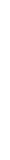

{: height="160px" } {: height="160px" } {: height="160px" }

# Swiss Tablesoccer Federation (STF) – Coral

&nbsp;&nbsp;&nbsp;&nbsp;🇩🇪 [**Deutsch**](#deutsch) &nbsp;|&nbsp; 🇫🇷 [**Français**](#francais) &nbsp;|&nbsp; 🇮🇹 [**Italiano**](#italiano)

---

## Inhalt / Table des matières / Indice

### 🇩🇪 Deutsch {#deutsch}
- [Register](de/register/)
- [Lizenzen](de/licenses/)
- [Turniere](de/tournaments/)
- [Clubs](de/club/)
- [AGB](de/terms/)

### 🇫🇷 Français {#francais}
- [Registre](fr/register/)
- [Licences](fr/licenses/)
- [Tournois](fr/tournaments/)

### 🇮🇹 Italiano {#italiano}
- [Registro](it/register/)
- [Licenze](it/licenses/)
- [Tornei](it/tournaments/)

### Links

- **Coral**: [app.tablesoccer.org](https://app.tablesoccer.org)
- **Swiss Tablesoccer Federation (STF)**: [swisstablesoccer.ch](https://swisstablesoccer.ch)
- **Referee Program**: [referee.swisstablesoccer.ch](https://referee.swisstablesoccer.ch)
