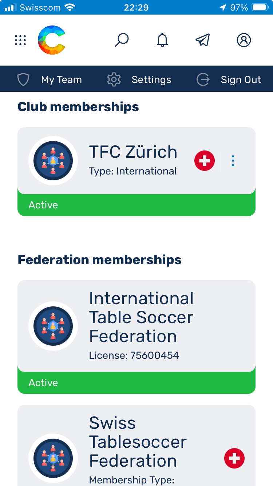

# Swiss Tablesoccer Federation (STF) goes Coral

Liebe Tischfussball-Community,

die STF freut sich verkünden zu dürfen, dass mit der Saison 2025 endlich der Wechsel auf die neue Turnier Software *[Coral - https://app.tablesoccer.org](https://app.tablesoccer.org)* erfolgen wird. Die Software wird mittelfristig wensentliche administrative und organisatorische Erleichterungen bringen, welche signifikante Einsparungen bei personellen Ressourcen ermöglichen. Das bedeutet das absofort (Januar 2025) alle Turniere mit Coral abgewickelt werden. Dies bringt vorerst nachfolgende Änderungen mitsich:

- Turniere werden ab sofort auf [Coral](https://app.tablesoccer.org) ausgeschrieben
- __Anmeldung für Turniere erfolgt absofort über [Coral](https://app.tablesoccer.org)__ und nicht mehr wie bisher über [https://register.swisstablesoccer.ch](https://register.swisstablesoccer.ch). Das bisherige Registrierungs-Tool wurde dekomissioniert und durch eine Onepager ersetzt.
- Resultate können ab sofort auf dem Handy von den Spielenden selbst eingegeben werden. Dies entlastet die Turnierleitung und erlaubt zügiges aufrufen wartender Spiele.
- Die Ranglisten der Saison 2025 werden auf Coral geführt. Bereits ausgetragenen Turniere im 2024, welche bereits zur Saison 2025 zählen, werden in den kommenden 1-2 Monate in Coral importiert sein.
- __An den Turnieren wird das Recall-Protokoll eingeführt__. Dies erlaubt uns sicherzustellen, dass Spiele schneller aufgenommen und empfindliche Verzögerungen im Zeitplan vermieden werden können. Dadurch wird das Spielerlebnis aller Turnierteilnehmenden erheblich verbessert, vermeidet frustration und erlaubt uns hoffentlich den Modus in Zukunft zu Gunsten der Spielenden anzupassen. Das Recall-Protokoll wird am STS in Luzern zum ersten Mal getestet werden.

Die STF arbeitet daran den Informationsfluss und -gehalt zur Coral-Einführung zu verbessern. Ebenfalls sind wir dabei, nach und nach Personen zu Berechtigen, Vereine und Turniere zu verwalten. Bei Frage wendet euch bitte wie gewohnt an [sport@swisstablesoccer.ch](mailto:sport@swisstablesoccer.ch).

## Inhaltsverzeichnis

- *TODO*

## Coral Accounts

Hast Du bereits einmal an einem ITSF-Turnier (die meisten Turniere der Swiss Tablesoccer Series (STS) sind auch ITSF-Turniere) mitgespielt, dann bist Du bereits in Coral registriert. In diesem Fall kannst Du den bereits für Dich erstellten Account übernehmen. Dieser ist automatisch auch bereits mit Deiner ITSF-Nummer verknüpft. Klicke hierfür auf [Account Take Over](https://app.tablesoccer.org/take-over) und folge den Anweisungen. Nachfolgend verlinktes Youtube-Video führt Dich durch die einzelnen Schritte, solltest Du dabei Hilfe benötigen.

- [Account Take Over](https://app.tablesoccer.org/take-over)
- [Tutorial](https://www.youtube.com/watch?v=9JbgURqE2IE)

Falls Du mit Sicherheit zum ersten Mal an einem ITSF-Turnier teilnimmst, musst Du einen neuen [Account eröffnen](https://app.tablesoccer.org/register). Bitte überprüfe dabei, ob Du Deinen Namen wirklich nicht in der Liste bereits registrierter Liste findest und bestätige, dass Du nicht auf der Liste bist.

- [⁠Neuen Account Erstellen](https://app.tablesoccer.org/register)

## Anmelden für Turniere

Um Dich für Turniere anmelden zu können, musst Dein Status erst auf *Active* sein. Falls Dein Status auf *inactive* ist (siehe nachfolgende Bildschirmfotos), musst Du diesen erst aktivieren. Klicke hierfür auf *renew*, falls Du bereits Mitglied eines Clubs bist oder trete einfach Deinem Verein bei indem Du auf *Join Club* klickst (Siehe hierzu [Einem Club beitreten](#)). Wähle in beiden Fällen die passende [Mitgliedschaft](#) aus.

- *TODO Mitgliedschaft/Lizenzen*

## ⁠Einem Club beitreten

Um einem Club beitreten zu können kannst Du unter Deinem *Profile > Join Club* auswählen. Danach im Suchfeld nach Deinem Verein suchen, die passende Mitgliedschaft auswählen und erforderliche Informationen ausfüllen. Wähle die Mitgliedschaft wie folgt:
- __International__ falls Du eine Jahreslizenz bei der STF erworben hast und planst ITSF-Turniere zu spielen
- __National__ falls Du eine Jahreslizenz bei der STF erworben hast und planst, keine ITSF-Turniere zu spielen
- __Club__ falls Du keine Jahreslizenz bei der STF erworben hast und in allen anderen Fällen

## ⁠Während eines Turniers
- Resultat Eingabe
- ⁠Recalls

## Ein Turnier aufschalten

Falls Dein Verein ein Regio-Turnier durchführen möchte, muss dieses ab Januar 2025 in Coral eingetragen, durchgeführt und darüber abgewickelt werden. Wir werden diese Seite demnächst entsprechend erweitern. Für den Moment, wende Dich bitte wie gewohnt an [sport@swisstablesoccer.ch](mailto:sport@swisstablesoccer.ch). Teil uns bitte gleich mit, wen wir zur Eingabe des Turniers in Coral berechtigen und in den Kreis der Coral-Manager aufnehmen dürfen. Dies Person wird dann entsprechende Infos und Schulung erhalten.

- Swiss Tablesoccer Regio Tour Status erwerben

## ⁠FAQ

__#1 Ich kann mich nicht für Competitions registrieren. Die einzelnen Disziplinen sind ausgegraut__
- Player Status entspricht nicht den Anforderungen. -> Membership STF (National oder Club) auf Active oder Club beitreten und Membership "Club" wählen
- Alter erlaubt die Teilnahme an Senioren-Disziplinen nicht -> Edit Profil Information, dort Alter korrigieren

__#2 Coral zeigt nach dem Login auf dem PC nur eine weisse Oberfläche an__
Falls bei einem Benutzer auf dem PC nach dem Login in Coral nur eine weisse Seite angezeigt werden sollte, dann könnte dies damit zu tun haben, das seine Zeiteinstellung nicht in Ordnung ist. Sprich seine Zeit auf dem PC ist nicht synchronisiert (z.B. 3 Minuten hinter der effektiven Zeit).
Dies kann passieren, wenn man die automatische Zeitsynchronisation in Windows deaktiviert hat. Um das zu beheben, geht in die Zeiteinstellungen von Windows und aktiviert das automatische setzen der Zeit sowie der zeitzone:

__#3.1 Wie kann ich Coral als Web-App installieren?__

__#3.2 Push-Benachrichtigungen funktionieren nicht auf meinem Handy__
Um Push-Benachrichtigungen aktivieren zu können, muss Coral (app.tablesoccer.org) erst dem Home-Bildschirm hinzugefügt werden (Installation als Web-App). Siehe _FAQ #3.1_

Push-Benachrichtigungen müssen dann zweistufig aktiviert werden. Erst unter *Profile > Settings > Notification*. 

Dann unterm Turnier selbst. Die Einstellung im Profil ist notwendig, damit Android oder iPhone die Push-Benachrichtigungen auf System-Level aktivieren.
Einmal aktiviert, werden die Einstellungen im Profil als Standard für zukünftige Turniere genommen. Es muss also nicht jedes Mal neu aktiviert werden.

__#4 die Tabelle zeigt mir das Buchholz nicht an__
- Auf Mobilegeräte wird Hochformat die Tabelle verkürzt dargestellt: Teamname, Platzierung, Punkte
- Im Querformat wird die Tabelle vollständig angezeigt. B steht für Buchholz, SB für Small Buchholz resp. Feinbuchholz

__⁠#4 Wlan an Turniere__

- *TODO*

