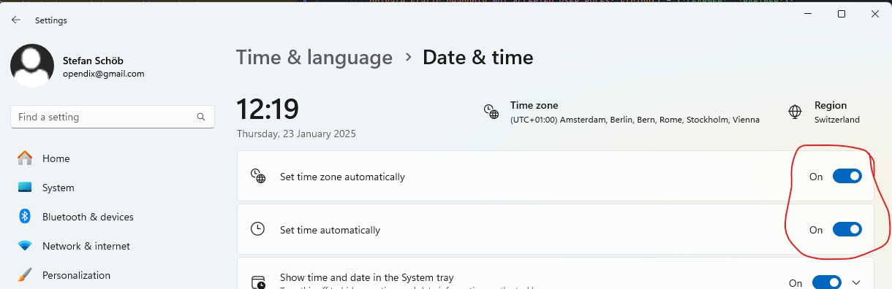
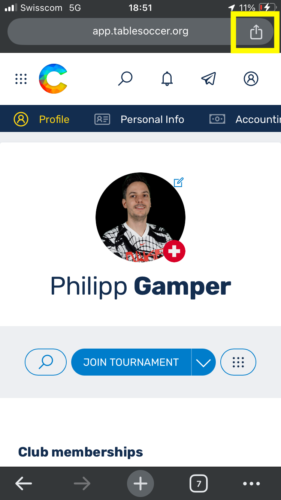
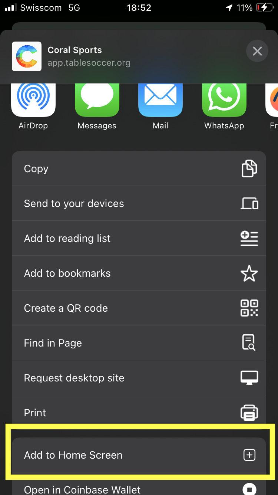
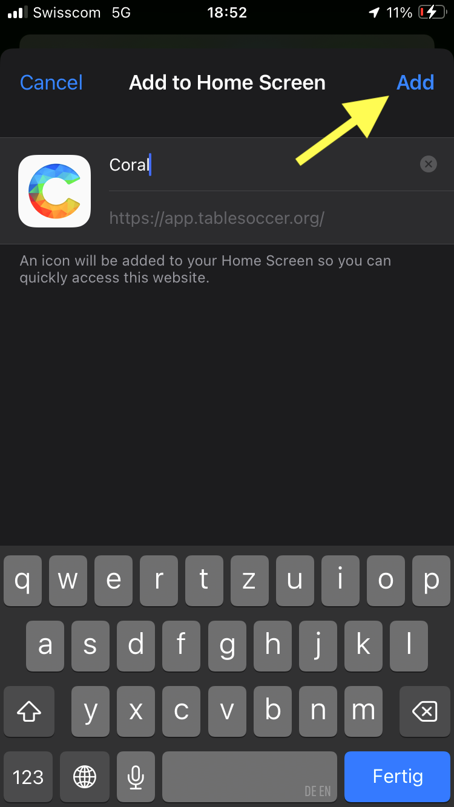
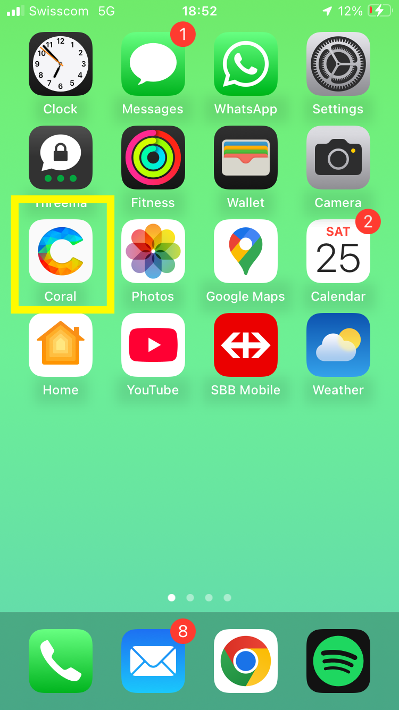
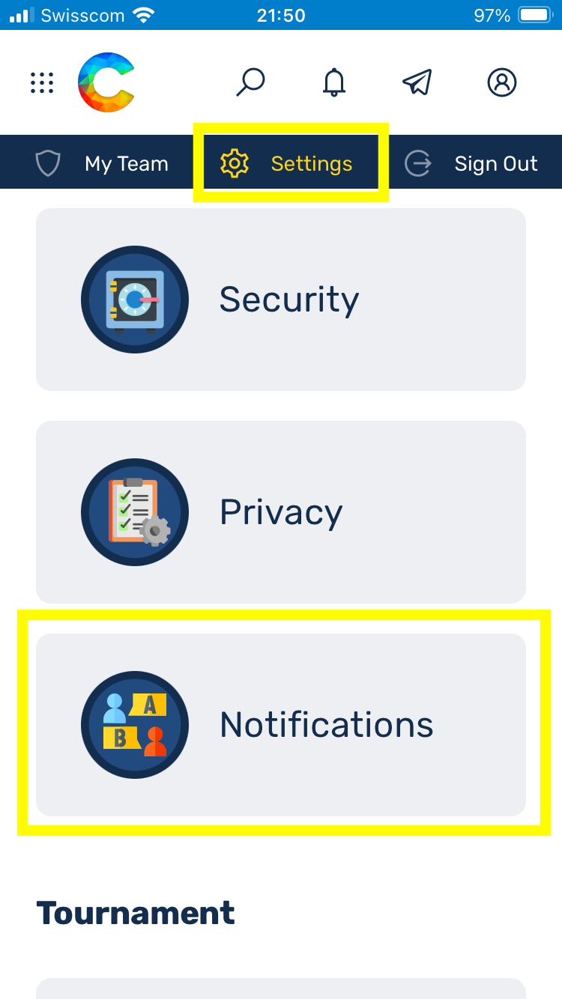
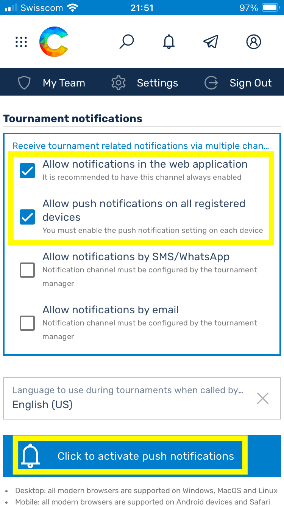
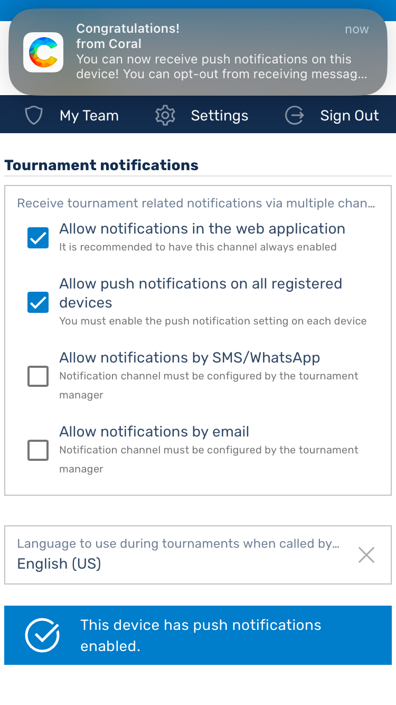
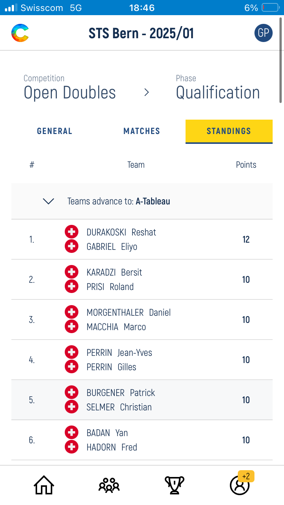
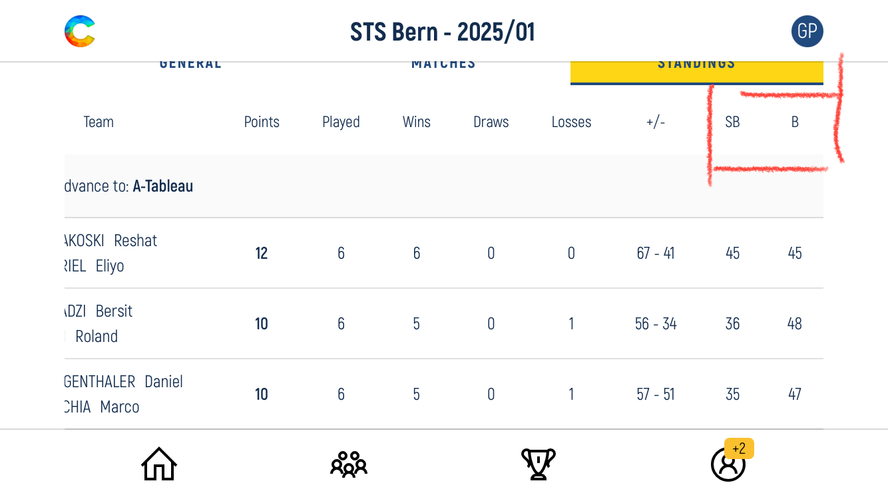

# ⁠FAQ

## \#1 Ich kann mich nicht für Competitions registrieren. Die einzelnen Disziplinen sind ausgegraut
- Player Status entspricht nicht den Anforderungen. -> Membership STF (National oder Club) auf Active oder Club beitreten und Membership "Club" wählen
- Alter erlaubt die Teilnahme an Senioren-Disziplinen nicht -> Edit Profil Information, dort Alter korrigieren

## \#2 Coral zeigt nach dem Login auf dem PC nur eine weisse Oberfläche an
Falls bei einem Benutzer auf dem PC nach dem Login in Coral nur eine weisse Seite angezeigt werden sollte, dann könnte dies damit zu tun haben, das seine Zeiteinstellung nicht in Ordnung ist. Sprich seine Zeit auf dem PC ist nicht synchronisiert (z.B. 3 Minuten hinter der effektiven Zeit).
Dies kann passieren, wenn man die automatische Zeitsynchronisation in Windows deaktiviert hat. Um das zu beheben, geht in die Zeiteinstellungen von Windows und aktiviert das automatische setzen der Zeit sowie der zeitzone:

## \#3.1 Wie kann ich Coral als Web-App installieren?

## \#3.2 Push-Benachrichtigungen funktionieren nicht auf meinem Handy
Um Push-Benachrichtigungen aktivieren zu können, muss Coral (app.tablesoccer.org) erst dem Home-Bildschirm hinzugefügt werden (Installation als Web-App). Siehe _FAQ #3.1_

Push-Benachrichtigungen müssen dann zweistufig aktiviert werden. Erst unter *Profile > Settings > Notification*. 

Dann unterm Turnier selbst. Die Einstellung im Profil ist notwendig, damit Android oder iPhone die Push-Benachrichtigungen auf System-Level aktivieren.
Einmal aktiviert, werden die Einstellungen im Profil als Standard für zukünftige Turniere genommen. Es muss also nicht jedes Mal neu aktiviert werden.

## \#4 die Tabelle zeigt mir das Buchholz nicht an
- Auf Mobilegeräte wird Hochformat die Tabelle verkürzt dargestellt: Teamname, Platzierung, Punkte
- Im Querformat wird die Tabelle vollständig angezeigt. B steht für Buchholz, SB für Small Buchholz resp. Feinbuchholz

⁠## \#4 Wlan an Turniere

- *TODO*

