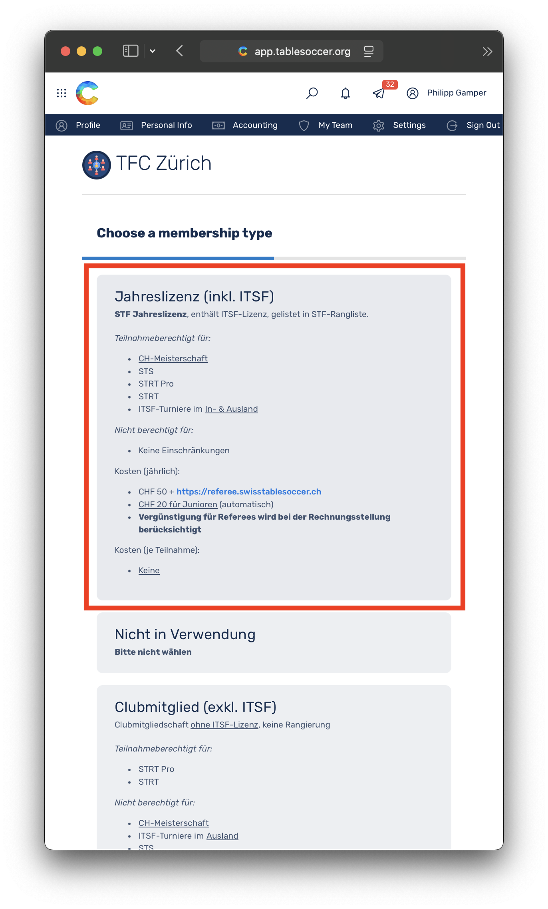
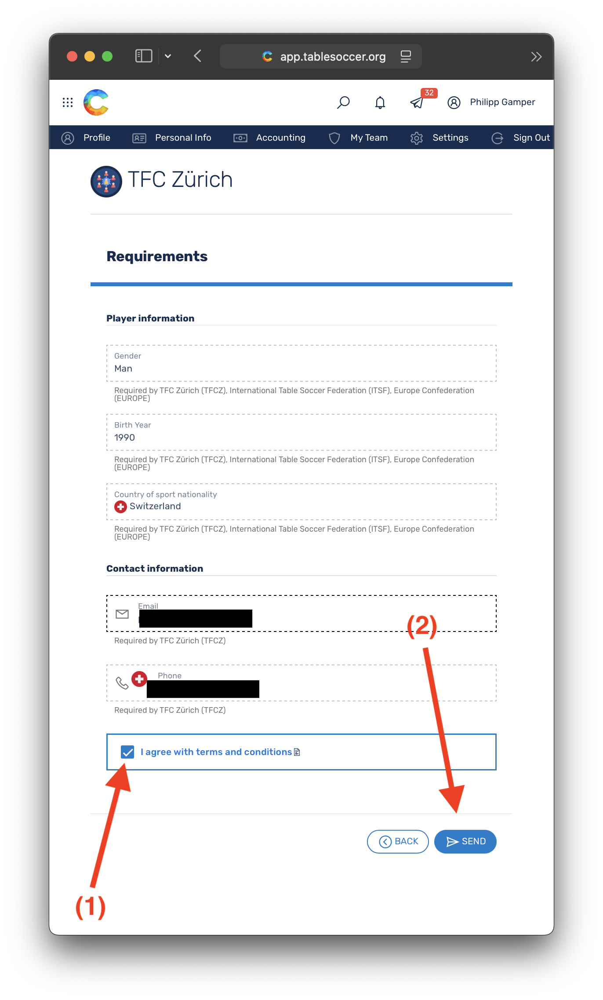
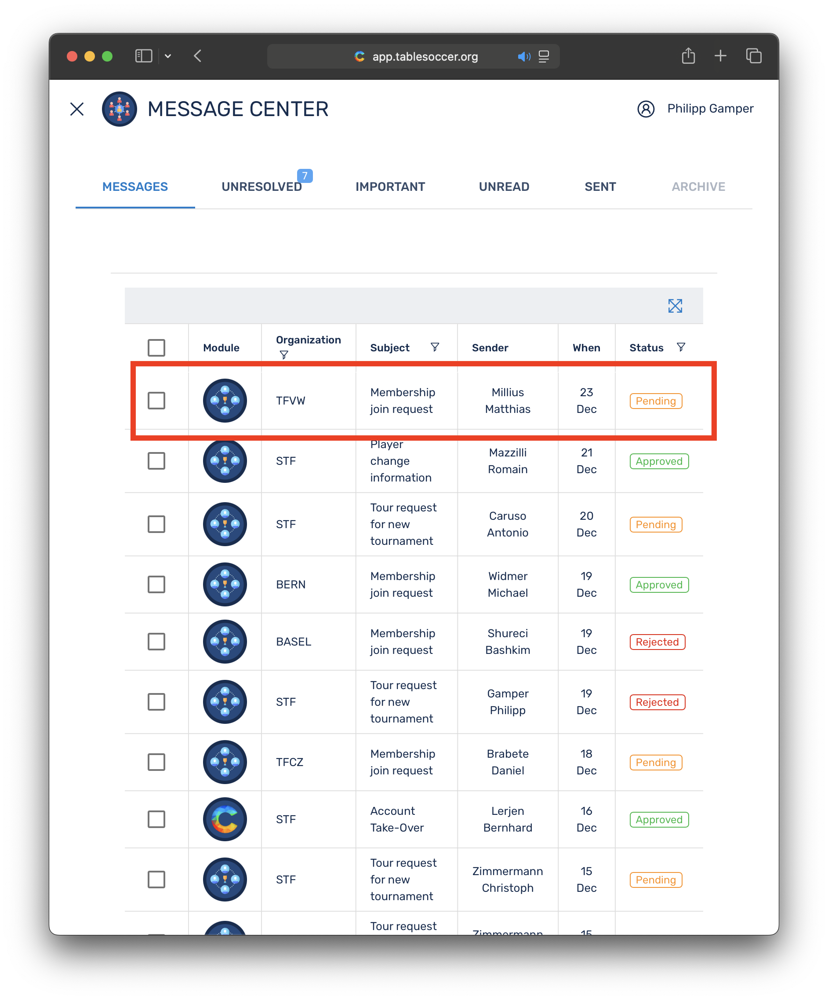

🌐 **Langue / Sprache:** [Deutsch](/licenses/) | **Français**

---

# Délivrance des licences à partir de 2026 via Coral

Sur la base du nouveau [règlement financier](https://static1.squarespace.com/static/6797790a8025010384cf53f2/t/68ffb77095bbce1af05a15ac/1761589104375/2025-10-23-Finanzreglement+Turnier+%26+Lizenzwesen.pdf), de nouveaux types de licences seront introduits à partir de 2026 et mis en œuvre dans [Coral](https://app.tablesoccer.ch) comme décrit ci-dessous. La délivrance des licences court à partir du jour de l'approbation jusqu'au 31 décembre de l'année en cours et est automatiquement désactivée au changement d'année. Les joueurs peuvent choisir et demander le [type de licence](#types-de-licences-%C3%A0-partir-de-2026) approprié directement dans [Coral](https://app.tablesoccer.ch). Les frais qui en découlent seront réglés comme auparavant auprès du club dont on est membre ou invité (voir aussi [Facturation](#facturation)). 

## Table des matières

- [Table des matières](#table-des-mati%C3%A8res)
- [Types de licences à partir de 2026](#types-de-licences-%C3%A0-partir-de-2026)
- [Coûts par type de licence](#co%C3%BBts-par-type-de-licence)
- [Demander une licence dans Coral](#demander-une-licence-dans-coral)
    * [Demande par les joueurs](#demande-par-les-joueurs)
    * [Approbation par les clubs](#approbation-par-les-clubs)
- [Facturation](#facturation)
- [Foire aux questions (FAQ)](#faq)
    * [\#1 Les licences sont-elles demandées directement dans Coral ?](#1-les-licences-sont-elles-demand%C3%A9es-directement-dans-coral)
    * [\#2 À qui dois-je payer les frais de licence ?](#2-%C3%A0-qui-dois-je-payer-les-frais-de-licence)
    * [\#3 Puis-je obtenir la licence annuelle en cours d'année ?](#3-puis-je-obtenir-la-licence-annuelle-en-cours-dann%C3%A9e)
    * [\#4 Puis-je mettre à niveau ma licence ?](#4-puis-je-mettre-%C3%A0-niveau-ma-licence)
    * [\#5 Quelle licence me convient ?](#5-quelle-licence-me-convient)
    * [\#6 Qui peut approuver des licences pour mon club ?](#6-qui-peut-approuver-des-licences-pour-mon-club)
    * [\#7 Vue d'ensemble de la délivrance des licences](#7-vue-densemble-de-la-d%C3%A9livrance-des-licences-2026)

## Types de licences à partir de 2026

| Type de licence | Description | Autorisé pour | Non autorisé pour | 
|:---|:---|:---|:---|
| __Licence annuelle (incl. ITSF)__ *(International)* | Licence annuelle STF, inclut la licence ITSF, figurant dans le classement STF | __Championnat suisse__, STS, STRT Pro, STRT, __Tournois ITSF en Suisse et à l'étranger__ | Aucune restriction | 
| __Membre de club (incl. ITSF)__ *(International)* | Adhésion au club, inclut la licence ITSF, __pas de classement__ | STS, STRT Pro, STRT | __Championnat suisse__, Tournois ITSF à __l'étranger__* | 
| __Membre de club (excl. ITSF)__ *(National)* | Adhésion au club sans licence ITSF, __pas de classement__ | STRT Pro, STRT | __Championnat suisse__, Tournois ITSF à __l'étranger__*, STS | 
| __Invité (incl. ITSF)__ *(International)* | Sport de masse, inclut la licence ITSF, __pas de classement__ | STS, STRT Pro, STRT | __Championnat suisse__, Tournois ITSF à __l'étranger__* | 
| __Invité (excl. ITSF)__ *(National)* | Sport de masse *sans délivrance de licence*, __pas de classement__| STRT Pro, STRT | __Championnat suisse__, Tournois ITSF à __l'étranger__*, STS | 

## Coûts par type de licence

| Type de licence | Frais de licence | STS | STRT Pro | STRT | ITSF WS | 
|:---|:---|:---:|:---:|:---:|:---:|
| Échéance | annuelle | par participation | par participation | par participation | par participation | 
| __Licence annuelle (incl. ITSF)__ *(International)* | CHF 50 + [Arbitre](https://referee.swisstablesoccer.ch) | Aucun | Aucun | Aucun | Aucun |
| __Membre de club (incl. ITSF)__ *(International)* | Aucun* | __CHF 15__ | Aucun | Aucun | __CHF 25__ |
| __Membre de club (excl. ITSF)__ *(National)* | Aucun | N/A | Aucun | Aucun | N/A |
| __Invité (incl. ITSF)__ *(International)* | Aucun* | __CHF 15__ | Aucun | Aucun | __CHF 25__ |
| __Invité (excl. ITSF)__ *(National)* | Aucun | N/A | Aucun | Aucun | N/A |

__\*__ Pour les tournois STS avec statut ITSF (250, 500, 750), une licence ITSF *active* est nécessaire. Les types de licences __*Membre de club (incl. ITSF)*__ et __*Invité (incl. ITSF)*__ permettent aux sportifs de masse (joueurs de pub occasionnels) une entrée facilitée dans le monde des tournois et __ne constituent pas__ une licence ITSF gratuite. En cas d'abus, CHF 25 seront facturés conformément au [règlement financier](https://static1.squarespace.com/static/6797790a8025010384cf53f2/t/68ffb77095bbce1af05a15ac/1761589104375/2025-10-23-Finanzreglement+Turnier+%26+Lizenzwesen.pdf) (3.2.1).

*__Avertissement :__ Les clubs sont autorisés à refuser des invités ou à exiger des frais d'administration. La STF n'a aucune influence sur la gestion de chaque club.*

## Demander une licence dans Coral

### Demande par les joueurs

__Première demande de licence__ voir [Rejoindre un club](../#rejoindre-un-club)

__Renouveler une licence__

Les images suivantes montrent comment une licence peut être renouvelée. Dans l'exemple, la *licence annuelle* est sélectionnée. Le tableau ci-dessus ou la [FAQ](#4-puis-je-mettre-%C3%A0-niveau-ma-licence) indiquent quel type de licence convient à qui.

{: width="320px" }
{: width="320px" }
{: width="320px" }

### Approbation par les clubs

La STF a désigné un _gestionnaire d'organisation_ pour chaque club membre. Celui-ci est responsable du contrôle et de l'approbation des demandes de licences. Les coûts générés par l'approbation des licences demandées seront facturés par la STF au club correspondant. Le contrôle et le recouvrement des montants dus relèvent de la responsabilité des clubs.

1. Contrôle du type de licence choisi. Le type de licence correspond-il à la personne ?

    {: width="320px" }
    {: width="320px" }
    {: width="320px" }
    {: width="320px" }

2. En cas de doute, se renseigner auprès de la personne et adapter le type de licence avant l'approbation. 

    {: width="320px" }

3. _Approbation_ ou _refus_ de la demande.

    {: width="320px" }

## Facturation

Tant pour les _gestionnaires d'organisation_ des clubs que pour la STF, les frais de licence qui s'accumulent sont directement visibles dans Coral sous `My Club` > `Accounting`.

En approuvant une licence, le club s'engage à prendre en charge les frais de licence qui en découlent. La STF facturera les frais de licence accumulés au plus tard à la fin de l'année (exceptions réservées). Il est recommandé aux clubs de refacturer les frais de licence 1:1 pour les membres du club et +frais d'administration pour les non-membres du club (invités).

## ⁠FAQ

### \#1 Les licences sont-elles demandées directement dans Coral ?

Les joueurs peuvent choisir et demander le [type de licence](#types-de-licences-%C3%A0-partir-de-2026) approprié directement dans [Coral](https://app.tablesoccer.ch).

### \#2 À qui dois-je payer les frais de licence ?

Les frais qui s'accumulent sont réglés comme auparavant auprès du club dont on est membre ou invité (voir aussi [Facturation](#facturation)). 

### \#3 Puis-je obtenir la licence annuelle en cours d'année ?

Oui, il est possible d'obtenir la licence annuelle en cours d'année. La délivrance des licences court à partir du jour de l'approbation jusqu'au 31 décembre de l'année en cours et est automatiquement désactivée au changement d'année.

### \#4 Puis-je mettre à niveau ma licence ?

Oui, il est possible de mettre à niveau sa licence en cours d'année. Cela entraîne les frais complets de la licence vers laquelle on monte. __Les frais déjà imputés et/ou payés, par exemple les frais de tournoi (anciennement licence journalière), ne sont pas crédités.__

### \#5 Quelle licence me convient ?

- Choisir *__Licence annuelle (incl. ITSF)__* si tu ...
    - ... participes régulièrement aux STS
    - ... participes régulièrement à la Regio-Tour (STRT & STRT Pro)
    - ... veux te qualifier pour le __Championnat suisse__
    - ... veux jouer des __tournois ITSF à l'étranger__. 
    - ... veux être __classé(e) dans le classement STF__ 
    - ... es un joueur de tournoi / sportif de compétition 
    - ... veux minimiser les charges administratives pour la STF

- Choisir *__Membre de club (incl. ITSF)__* si tu ...
    - ... participes au maximum à 1-2 STS par an 
    - ... participes régulièrement à la Regio-Tour (STRT & STRT Pro)
    - ... ne veux __pas__ participer au Championnat suisse
    - ... ne veux __pas__ jouer de tournois ITSF à l'étranger
    - ... ne veux __pas__ être classé(e) dans le classement STF
    - ... te comptes parmi les sportifs de masse (joueurs de pub)

- Choisir *__Membre de club (excl. ITSF)__* si tu ...
    - ... participes __seulement__ régulièrement à la Regio-Tour (STRT & STRT Pro)
    - ... ne veux __pas__ participer au Championnat suisse
    - ... ne veux __pas__ jouer de tournois ITSF à l'étranger
    - ... ne veux __pas__ être classé(e) dans le classement STF
    - ... te comptes parmi les sportifs de masse (joueurs de pub)

- Choisir *__Invité (incl. ITSF)__* si tu ...
    - ... n'es __pas__ un membre actif d'un club membre STF
    - ... participes au maximum à 1-2 STS par an 
    - ... participes régulièrement à la Regio-Tour (STRT & STRT Pro)
    - ... ne veux __pas__ participer au Championnat suisse
    - ... ne veux __pas__ jouer de tournois ITSF à l'étranger
    - ... ne veux __pas__ être classé(e) dans le classement STF
    - ... te comptes parmi les sportifs de masse (joueurs de pub)

- Choisir *__Invité (excl. ITSF)__* si tu ...
    - ... n'es __pas__ un membre actif d'un club membre STF
    - ... participes __seulement__ régulièrement à la Regio-Tour (STRT & STRT Pro)
    - ... ne veux __pas__ participer au Championnat suisse
    - ... ne veux __pas__ jouer de tournois ITSF à l'étranger
    - ... ne veux __pas__ être classé(e) dans le classement STF
    - ... te comptes parmi les sportifs de masse (joueurs de pub)

### \#6 Qui peut approuver des licences pour mon club ?

Le tableau suivant indique les personnes par club qui sont responsables de l'approbation et ont été instruites sur le processus.

| Club | Responsable de l'approbation |
|:---|:---|
| Associazione Table-Soccer Ticino (ATST) | David Baldasari |
| Bern Ballers | Mike Schrepfer |
| CFT Jura Seeland | Cyrill Amez |
| CFT Saloon Acacias | *Michel Burgener* |
| CFT du Chablais | Tristan Devaud |
| Capricorn Tablesoccer | Claudio Salzgeber |
| Foosballeur | Egon Kuonen |
| Fordere.ch Zürich | Philipp Gamper |
| TFC Bern | Sandra Gäumann |
| TFC Freiburg Sense | Christoph Burri |
| TFC Laupen | Stephan Frieden |
| TFC Luzern | Manuel Ragonesi |
| TFC Seetal | Peter Brogli |
| TFC Simmental | Oliver Mani |
| TFC St. Gallen | Steven Imhof |
| TFC Thayngen | *TBD* |
| TFC Thun | Paul Beyeler |
| TFC Zürich | Christoph Zimmermann |
| TFK Rüti | Thomas Maurer | 
| TFV Gams | N/A |
| TSS Goldach | Dusan Pekic & Hermann Fritsche |
| Tablesoccer b. Basel | Antonio Carruso & Nicole Weber |
| Töggeli Graben Bern | Marcos Peixoto |
| Wallisser Tischfussballverein | Michel Regotz |

### \#7 *Vue d'ensemble* de la délivrance des licences 2026

| Type de licence | Description | Autorisé pour | Non autorisé pour | Coûts (annuels) | STS | STRT (Pro) | ITSF WS | 
|:---|:---|:---|:---|:---|:---:|:---:|:---:|
| __Licence annuelle (incl. ITSF)__ *(International)* | Licence annuelle STF, inclut la licence ITSF, figurant dans le classement STF | __Championnat suisse__, STS, STRT Pro, STRT, __Tournois ITSF en Suisse et à l'étranger__ | Aucune restriction | CHF 50 + Arbitre | Aucun | Aucun | Aucun |
| __Membre de club (incl. ITSF)__ *(International)* | Adhésion au club, inclut la licence ITSF, __pas de classement__ | STS, STRT Pro, STRT | __Championnat suisse__, Tournois ITSF à __l'étranger__* | Aucun* | __CHF 15__ | Aucun | __CHF 25__ |
| __Membre de club (excl. ITSF)__ *(National)* | Adhésion au club sans licence ITSF, __pas de classement__ | STRT Pro, STRT | __Championnat suisse__, Tournois ITSF à __l'étranger__*, STS | Aucun | N/A | Aucun | N/A |
| __Invité (incl. ITSF)__ *(International)* | Sport de masse, inclut la licence ITSF, __pas de classement__ | STS, STRT Pro, STRT | __Championnat suisse__, Tournois ITSF à __l'étranger__* | Aucun* | __CHF 15__ | Aucun | __CHF 25__ |
| __Invité (excl. ITSF)__ *(National)* | Sport de masse *sans délivrance de licence*, __pas de classement__| STRT Pro, STRT | __Championnat suisse__, Tournois ITSF à __l'étranger__*, STS | Aucun | N/A | Aucun | N/A |

__\*__ Pour les tournois STS avec statut ITSF (250, 500, 750), une licence ITSF *active* est nécessaire. Les types de licences __*Membre de club (incl. ITSF)*__ et __*Invité (incl. ITSF)*__ permettent aux sportifs de masse (joueurs de pub occasionnels) une entrée facilitée dans le monde des tournois et __ne constituent pas__ une licence ITSF gratuite. En cas d'abus, CHF 25 seront facturés conformément au [règlement financier](https://static1.squarespace.com/static/6797790a8025010384cf53f2/t/68ffb77095bbce1af05a15ac/1761589104375/2025-10-23-Finanzreglement+Turnier+%26+Lizenzwesen.pdf) (3.2.1).
