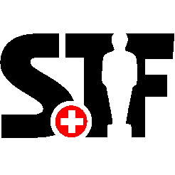

🌐 **Langue / Sprache / Lingua / Language:** [Deutsch](../../de/terms/) | **Français** | [Italiano](../../it/terms/) | [English](../../en/terms/)

---

{: height="160px" }

# Conditions Générales (CG)

## Table des matières

- [CG pour les associations membres](#cg-pour-les-associations-membres)
- [CG pour les joueurs](#cg-pour-les-joueurs)
- [CG pour les tournois](#cg-pour-les-tournois)

---

## CG pour les associations membres

Les conditions générales suivantes régissent les droits et obligations des associations membres envers la Swiss Tablesoccer Federation (STF).

1. En tant que membre de Swiss Olympic, la STF est soumise à la [Charte éthique](https://www.swissolympic.ch/fr/athlete-hub/personnalite/valeurs-ethique/charte-ethique), au [Statut éthique](https://www.swissolympic.ch/fr/athlete-hub/personnalite/valeurs-ethique/Ethik-Statut-des-Schweizer-Sports) et au [Statut antidopage](https://www.swissolympic.ch/fr/federations/prevention/antidoping) de Swiss Olympic ainsi qu'aux autres documents précisant ces règles.

2. La [Charte éthique](https://www.swissolympic.ch/fr/athlete-hub/personnalite/valeurs-ethique/charte-ethique), le [Statut éthique](https://www.swissolympic.ch/fr/athlete-hub/personnalite/valeurs-ethique/Ethik-Statut-des-Schweizer-Sports) et le [Statut antidopage](https://www.swissolympic.ch/fr/federations/prevention/antidoping) ainsi que les autres documents précisant ces règles sont contraignants pour la STF elle-même, ses collaborateurs, membres des organes, membres, sous-organisations (p. ex. associations régionales ou cantonales, sections, clubs) ainsi que pour leurs organes respectifs, membres, collaborateurs, athlètes, coaches, accompagnateurs, médecins et dirigeants.

3. La STF s'engage pour un sport sain, respectueux, équitable et couronné de succès. Elle incarne ces valeurs en traitant ses interlocuteurs avec respect, en agissant et en communiquant de manière transparente – elle-même ainsi que ses organes et membres. La STF et ses membres directs et indirects reconnaissent et respectent à cet effet la [Charte éthique](https://www.swissolympic.ch/fr/athlete-hub/personnalite/valeurs-ethique/charte-ethique), le [Statut éthique du sport suisse](https://www.swissolympic.ch/fr/athlete-hub/personnalite/valeurs-ethique/Ethik-Statut-des-Schweizer-Sports) et le [Statut antidopage](https://www.swissolympic.ch/fr/federations/prevention/antidoping) de Swiss Olympic ainsi que les autres documents précisant ces règles. La fédération sportive diffuse ces principes dans son domaine d'activité.

4. En tant que membre de la STF, les clubs et leurs membres sont soumis à la [Charte éthique](https://www.swissolympic.ch/fr/athlete-hub/personnalite/valeurs-ethique/charte-ethique), au [Statut éthique](https://www.swissolympic.ch/fr/athlete-hub/personnalite/valeurs-ethique/Ethik-Statut-des-Schweizer-Sports) et au [Statut antidopage](https://www.swissolympic.ch/fr/federations/prevention/antidoping) de Swiss Olympic ainsi qu'aux autres documents précisant ces règles.

5. Les associations membres s'engagent à respecter les règlements et statuts de la STF et à contribuer activement à leur mise en œuvre.

6. Les associations membres sont tenues d'informer leurs membres des règles et obligations en vigueur et d'en assurer le respect.

7. La STF a pour but de protéger l'intégrité, la sécurité et l'équité des compétitions de football de table contre toute forme de manipulation et/ou d'activités corrompues.

8. Les associations membres et leurs membres sont tenus de s'abstenir de toute forme d'influence déloyale et de manipulation des compétitions sportives et de respecter notamment les dispositions correspondantes de l'ITSF (International Table Soccer Federation) ainsi que du [Statut éthique](https://www.swissolympic.ch/fr/athlete-hub/personnalite/valeurs-ethique/Ethik-Statut-des-Schweizer-Sports) de Swiss Olympic. Pour le reste, les dispositions de l'ITSF et du Statut éthique pour le sport suisse s'appliquent.

9. En cas de violation des présentes CG ou des règlements de la STF, celle-ci se réserve le droit de prendre les mesures appropriées conformément aux statuts et règlements en vigueur, y compris le retrait de la qualité de membre.

---

## CG pour les joueurs

En s'inscrivant dans [Coral](https://app.tablesoccer.org) et en participant aux tournois de la STF, les joueurs acceptent les conditions générales suivantes.

1. En tant que membre de Swiss Olympic, la STF est soumise à la [Charte éthique](https://www.swissolympic.ch/fr/athlete-hub/personnalite/valeurs-ethique/charte-ethique), au [Statut éthique](https://www.swissolympic.ch/fr/athlete-hub/personnalite/valeurs-ethique/Ethik-Statut-des-Schweizer-Sports) et au [Statut antidopage](https://www.swissolympic.ch/fr/federations/prevention/antidoping) de Swiss Olympic ainsi qu'aux autres documents précisant ces règles.

2. La [Charte éthique](https://www.swissolympic.ch/fr/athlete-hub/personnalite/valeurs-ethique/charte-ethique), le [Statut éthique](https://www.swissolympic.ch/fr/athlete-hub/personnalite/valeurs-ethique/Ethik-Statut-des-Schweizer-Sports) et le [Statut antidopage](https://www.swissolympic.ch/fr/federations/prevention/antidoping) ainsi que les autres documents précisant ces règles sont contraignants pour la STF elle-même, ses collaborateurs, membres des organes, membres, sous-organisations (p. ex. associations régionales ou cantonales, sections, clubs) ainsi que pour leurs organes respectifs, membres, collaborateurs, athlètes, coaches, accompagnateurs, médecins et dirigeants.

3. La STF s'engage pour un sport sain, respectueux, équitable et couronné de succès. Elle incarne ces valeurs en traitant ses interlocuteurs avec respect, en agissant et en communiquant de manière transparente – elle-même ainsi que ses organes et membres. La STF et ses membres directs et indirects reconnaissent et respectent à cet effet la [Charte éthique](https://www.swissolympic.ch/fr/athlete-hub/personnalite/valeurs-ethique/charte-ethique), le [Statut éthique du sport suisse](https://www.swissolympic.ch/fr/athlete-hub/personnalite/valeurs-ethique/Ethik-Statut-des-Schweizer-Sports) et le [Statut antidopage](https://www.swissolympic.ch/fr/federations/prevention/antidoping) de Swiss Olympic ainsi que les autres documents précisant ces règles. La fédération sportive diffuse ces principes dans son domaine d'activité.

4. Les joueurs reconnaissent et acceptent lors de la délivrance de leur licence les règlements, statuts et décisions de la STF ainsi que de l'ITSF (International Table Soccer Federation) comme contraignants.

5. Les joueurs s'engagent à adopter un comportement équitable envers les autres joueurs, les arbitres, les organisateurs de tournois et toutes les autres personnes impliquées.

6. Les joueurs sont tenus de respecter les dispositions antidopage en vigueur de Swiss Olympic. Les violations sont sanctionnées conformément au [Statut antidopage](https://www.swissolympic.ch/fr/federations/prevention/antidoping) de Swiss Olympic.

7. En demandant une licence dans [Coral](https://app.tablesoccer.org), les joueurs confirment avoir lu et accepté les présentes CG.

8. La STF a pour but de protéger l'intégrité, la sécurité et l'équité des compétitions de football de table contre toute forme de manipulation et/ou d'activités corrompues.

9. Les joueurs sont tenus de s'abstenir de toute forme d'influence déloyale et de manipulation des compétitions sportives et de respecter notamment les dispositions correspondantes de l'ITSF (International Table Soccer Federation) ainsi que du [Statut éthique](https://www.swissolympic.ch/fr/athlete-hub/personnalite/valeurs-ethique/Ethik-Statut-des-Schweizer-Sports) de Swiss Olympic. Pour le reste, les dispositions de l'ITSF et du Statut éthique pour le sport suisse s'appliquent.

10. En cas de violation des présentes CG ou des règlements de la STF, celle-ci se réserve le droit de prendre les mesures appropriées, y compris l'exclusion temporaire ou permanente du circuit des tournois.

---

## CG pour les tournois

En s'inscrivant à un tournoi de la STF, les joueurs acceptent les conditions générales suivantes pour les tournois.

1. En tant que membre de Swiss Olympic, la STF est soumise à la [Charte éthique](https://www.swissolympic.ch/fr/athlete-hub/personnalite/valeurs-ethique/charte-ethique), au [Statut éthique](https://www.swissolympic.ch/fr/athlete-hub/personnalite/valeurs-ethique/Ethik-Statut-des-Schweizer-Sports) et au [Statut antidopage](https://www.swissolympic.ch/fr/federations/prevention/antidoping) de Swiss Olympic ainsi qu'aux autres documents précisant ces règles. Ces dispositions s'appliquent à tous les participants aux tournois de la STF.

2. La [Charte éthique](https://www.swissolympic.ch/fr/athlete-hub/personnalite/valeurs-ethique/charte-ethique), le [Statut éthique](https://www.swissolympic.ch/fr/athlete-hub/personnalite/valeurs-ethique/Ethik-Statut-des-Schweizer-Sports) et le [Statut antidopage](https://www.swissolympic.ch/fr/federations/prevention/antidoping) ainsi que les autres documents précisant ces règles sont contraignants pour tous les participants aux tournois, les organisateurs, les arbitres et autres dirigeants.

3. Les joueurs participant à un tournoi de la STF acceptent les présentes CG ainsi que tous les autres règlements en vigueur de la STF. L'inscription à un tournoi vaut confirmation de cette acceptation.

4. Les joueurs s'engagent à se présenter ponctuellement à leurs matchs. En cas d'absences répétées (protocole de rappel), les joueurs peuvent être disqualifiés.

5. Les joueurs s'engagent à adopter un comportement sportif équitable. Un comportement antisportif peut entraîner la disqualification.

6. Les inscriptions aux tournois s'effectuent exclusivement via [Coral](https://app.tablesoccer.org). Les inscriptions par d'autres canaux ne sont pas acceptées.

7. Une licence valide (conformément aux [dispositions de licence](../licenses/) en vigueur) est une condition préalable à la participation aux tournois soumis à une exigence de licence. Les joueurs sans licence valide peuvent être exclus de la participation.

8. Les frais de tournoi et de licence éventuels doivent être acquittés conformément aux [dispositions de licence](../licenses/) en vigueur et au règlement du tournoi. En s'inscrivant à un tournoi, les joueurs s'engagent à payer les frais applicables.

9. Les décisions des arbitres et de la direction du tournoi doivent être respectées et sont contraignantes. Les réclamations doivent être déposées conformément au règlement en vigueur.

10. La STF a pour but de protéger l'intégrité, la sécurité et l'équité des compétitions de football de table contre toute forme de manipulation et/ou d'activités corrompues.

11. Tous les participants aux tournois sont tenus de s'abstenir de toute forme d'influence déloyale et de manipulation des compétitions sportives et de respecter notamment les dispositions correspondantes de l'ITSF (International Table Soccer Federation) ainsi que du [Statut éthique](https://www.swissolympic.ch/fr/athlete-hub/personnalite/valeurs-ethique/Ethik-Statut-des-Schweizer-Sports) de Swiss Olympic. Pour le reste, les dispositions de l'ITSF et du Statut éthique pour le sport suisse s'appliquent.

12. En cas de violation des présentes CG ou des règlements de la STF, celle-ci se réserve le droit de prendre les mesures appropriées, y compris l'exclusion du tournoi en cours ainsi que des tournois futurs.
