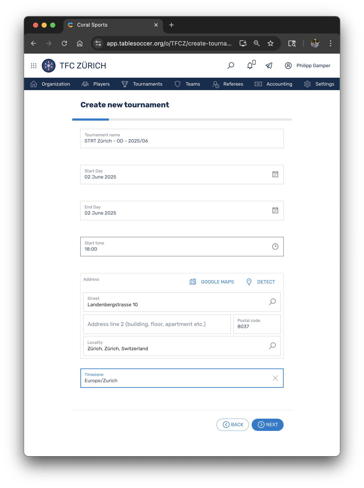
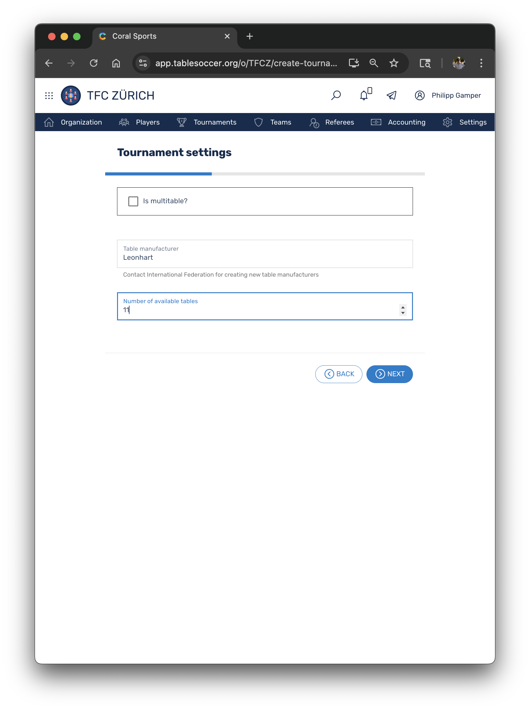
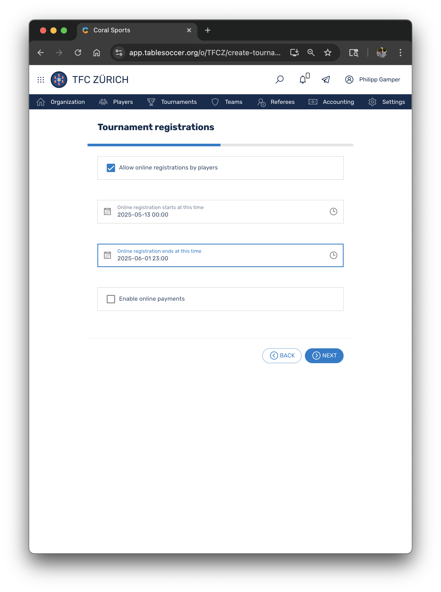
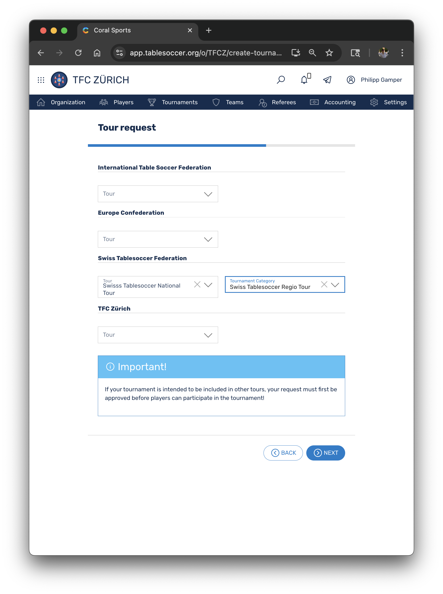
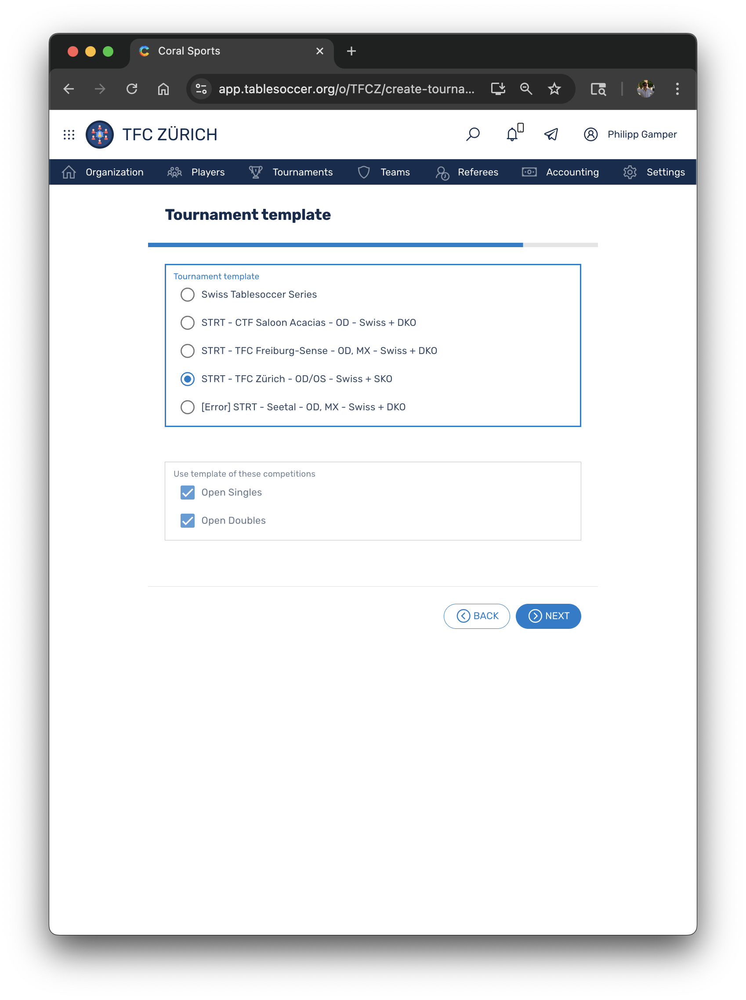
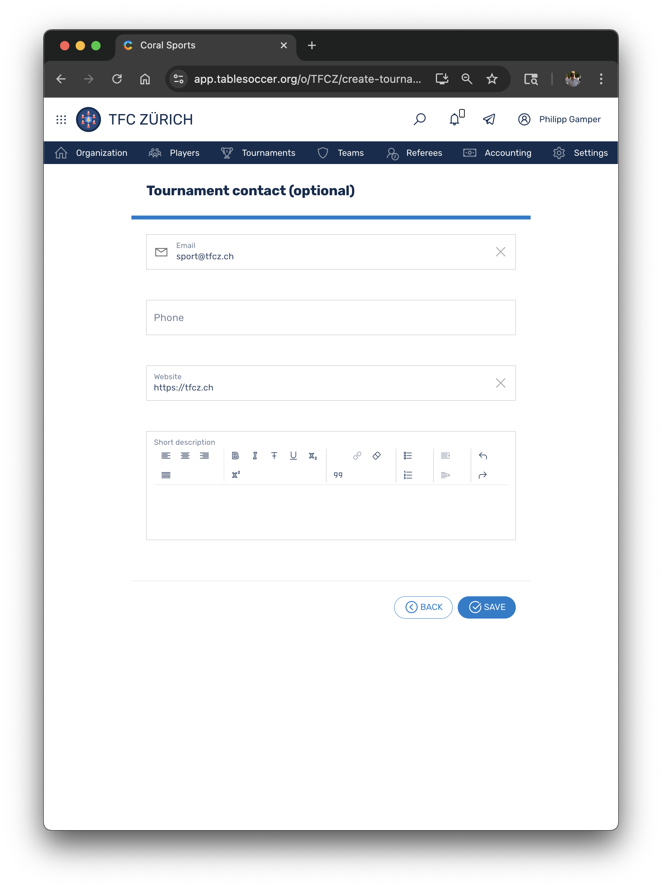

🌐 **Langue / Sprache:** [Deutsch](../../de/tournaments/) | **Français**

---

{: width="960px" } 

# La Swiss Tablesoccer Federation (STF) adopte Coral

Chère communauté du baby-foot,

le passage au nouveau logiciel de tournoi *[Coral - https://app.tablesoccer.org](https://app.tablesoccer.org)* au 1er janvier 2025 nous permet de numériser beaucoup de choses et donc de minimiser simultanément la charge administrative pour toutes les parties concernées. Ainsi, l'organisation administrative autour de la gestion des tournois est également simplifiée et centralisée - les formulaires Google dispersés, les feuilles Excel et les échanges d'e-mails pourront à l'avenir être largement évités. 

Les changements les plus importants en bref :
- L'inscription à tous les tournois, tant STRT que STS, se fait désormais via Coral *→ voir [Inscription au tournoi](#inscription)*
- Les critères d'attribution du statut STRT ont été rédigés et publiés *→ voir [Critères d'acceptation](#crit%C3%A8res-dacceptation-strt)*
- __La licence journalière (CHF 3) pour les tournois régionaux (STRT) a été supprimée__. À la place, un forfait de CHF 20 par STRT a été introduit *→ voir [Délivrance des licences STRT](#d%C3%A9livrance-des-licences-strt)*
- Plus besoin de décompte ni de soumission manuelle des résultats
- Plus besoin de logiciel sportif préinstallé, Coral fonctionne entièrement comme application web

## Table des matières

- [Table des matières](#table-des-mati%C3%A8res)
- [Statut Tour](#statut-tour)
    - [Critères d'acceptation STRT](#crit%C3%A8res-dacceptation-strt)
    - [Critères d'acceptation STS](#crit%C3%A8res-dacceptation-sts)
    - [Critères d'acceptation STS avec statut ITSF](#crit%C3%A8res-dacceptation-sts-avec-statut-itsf)
- [Délivrance des licences STRT](#d%C3%A9livrance-des-licences-strt)
- [Gestion des tournois](#gestion-des-tournois)
    - [Inscription](#inscription)
    - [Déroulement](#d%C3%A9roulement)
    - [Clôture](#cl%C3%B4ture)
    - [Modèles](#mod%C3%A8les)
- [Foire aux questions (FAQ)](#faq)

Remarque : il est recommandé de faire les demandes de tournoi sur un ordinateur ou une tablette

## Statut Tour

Le [Règlement sport individuel v.2004-1](https://swisstablesoccer.ch/s/Reglement-Individualsport.pdf) (consulté le 13 mai 2025) définit les catégories de tournois suivantes - appelées *Tour Status* dans Coral.

| Catégorie | Description | Frais1 | Droit d'entrée2 | Délivrance de licences3 | Critères |
|:---|:---|:---|:---|:---|:---|
| __STRT__ | Swiss Tablesoccer Regio Tour | CHF 20 | - | Aucune |[Critères d'acceptation STRT](#crit%C3%A8res-dacceptation-strt) |
| __STS__ | Swiss Tablesoccer Series | - | 20% | Licence STF | [Critères d'acceptation STS](#crit%C3%A8res-dacceptation-sts) |
| __STS WT 250__ | Swiss Tablesoccer Series avec ITSF World Tour 250| CHF 150 | 20% | Licence ITSF & STF |[Critères d'acceptation STS avec statut ITSF](#crit%C3%A8res-dacceptation-sts-avec-statut-itsf) |
| __STS WT 500__ | Swiss Tablesoccer Series avec ITSF World Tour 500| CHF 300 | 20% | Licence ITSF & STF | [Critères d'acceptation STS avec statut ITSF](#crit%C3%A8res-dacceptation-sts-avec-statut-itsf) |

*1 Les coûts pour le statut ITSF sont transférés à l'organisateur. Pour le STRT, un forfait remplace les licences journalières. Pour les STS sans statut ITSF, aucun frais n'est appliqué.*

*2 La répartition 60-20-20 (prix, organisateur, pot championnat) du droit d'entrée est réglée dans le règlement sport individuel. Pour le STRT, l'organisateur dispose de la répartition du droit d'entrée.*

*3 La STF propose des licences annuelles et journalières. L'ITSF propose uniquement des licences annuelles (€10). Un aperçu des différents types de licences se trouve [ici](../#9-quels-types-de-licences-existent-dans-coral-et-comment-correspondent-ils-aux-structures-stf-connues).*

### Critères d'acceptation STRT

Demandes pour les tournois de catégorie STRT
- La demande se fait via Coral. Les demandes par e-mail, WhatsApp, canaux obsolètes (par exemple Google Forms) ou d'autres voies seront refusées.
- La demande doit avoir été effectuée __au moins 60 jours avant la date de la manifestation__. L'horodatage dans Coral fait foi. 
- Un intervalle d'au moins 2 jours avec les tournois ayant le statut *STS*, *STS WT 250*, *STS WT500* et *STL* avant et après la manifestation est obligatoire.
- Un STRT ne peut pas se dérouler pendant la Coupe du Monde, la Garlando WS ou la Leo WS.
- Le STRT a été correctement saisi dans Coral, y compris les coordonnées de l'organisateur du tournoi 
- Le STRT est accompagné d'un règlement (PDF) dans au moins l'une des quatre langues *allemand*, *français*, *italien* ou *anglais*.  
- Le [modèle]() de la STF a été utilisé pour le règlement.

*__Remarque :__ La STF se réserve le droit, dans des cas exceptionnels justifiés, de retirer à nouveau le statut de Regio Tour à des tournois de catégorie STRT déjà approuvés.*

### Critères d'acceptation STS

*TODO*

### Critères d'acceptation STS avec statut ITSF

*TODO*

## Délivrance des licences STRT

Avec l'introduction de Coral, la STF a décidé, dans le cadre de la simplification des processus administratifs, de supprimer les licences journalières (CHF 3) pour les tournois régionaux (STRT). À la place, un forfait de CHF 20 est dû par tournoi régional organisé et comptabilisé. Ce forfait sera facturé par la STF directement aux clubs individuels après la clôture de la saison. Cela entraîne les simplifications suivantes :

- Le décompte du tournoi (document Excel) à l'intention de la STF disparaît
- Un virement immédiatement après le tournoi devient superflu. Les frais qui s'accumulent sont facturés une fois par an
- Tous les joueurs sont admis aux tournois régionaux, une licence journalière ou annuelle n'est plus nécessaire. Un rapprochement avec la liste des personnes licenciées n'est plus nécessaire.
- La charge administrative pour les collaborateurs de la STF se réduit considérablement.

## Gestion des tournois
*TODO*

### Inscription
-  Assistant 

{: width="480px" }
{: width="480px" }

{: width="480px" }
{: width="480px" }

{: width="480px" }
{: width="480px" }

- Utiliser les messages

### Déroulement
*TODO*

### Clôture
*TODO*

### Modèles
*TODO*

## ⁠FAQ

### \#1 TODO
