🌐 **Lingua / Sprache / Langue:** [Deutsch](../de/) | [Français](../fr/) | **Italiano**

---

# La Swiss Tablesoccer Federation (STF) adotta Coral

Cara comunità del calciobalilla,

la STF è lieta di annunciare che con la stagione 2025 avverrà finalmente il passaggio al nuovo software per tornei *[Coral - https://app.tablesoccer.org](https://app.tablesoccer.org)*. A medio termine, il software apporterà miglioramenti amministrativi e organizzativi essenziali, consentendo risparmi significativi in termini di risorse umane. Ciò significa che da ora (gennaio 2025) tutti i tornei saranno gestiti tramite Coral. In un primo tempo, questo comporta i seguenti cambiamenti:

- I tornei sono ora pubblicati su [Coral](https://app.tablesoccer.org). (Un torneo non è ancora presente? Grazie per la pazienza, ci stiamo lavorando!)
- __L'iscrizione ai tornei avviene ora tramite [Coral](https://app.tablesoccer.org)__ e non più come in precedenza tramite [https://register.swisstablesoccer.ch](https://register.swisstablesoccer.ch). Il vecchio strumento di registrazione è stato dismesso e sostituito da una pagina singola.
- I risultati possono ora essere inseriti direttamente sul cellulare dai giocatori stessi. Questo alleggerisce la direzione del torneo e consente di richiamare rapidamente le partite in attesa.
- Le classifiche della stagione 2025 saranno gestite su Coral. I tornei già disputati nel 2024, che contano già per la stagione 2025, saranno importati in Coral nei prossimi 1-2 mesi.
- __Il protocollo di richiamo (Recall) sarà introdotto nei tornei__. Questo ci permette di assicurare che le partite vengano avviate più rapidamente e che i ritardi significativi nel calendario possano essere evitati. Il protocollo di richiamo sarà testato per la prima volta all'STS di Lucerna.

La STF sta lavorando al miglioramento del flusso e del contenuto delle informazioni riguardanti l'introduzione di Coral. Stiamo anche autorizzando progressivamente delle persone a gestire club e tornei. Per qualsiasi domanda, rivolgiti come al solito a [sport@swisstablesoccer.ch](mailto:sport@swisstablesoccer.ch).

## Indice

- [Indice](#indice)
- [Account Coral](#account-coral)
- [Iscriversi ai tornei](#iscriversi-ai-tornei)
- [Unirsi a un club](#unirsi-a-un-club)
- [Durante un torneo](#durante-un-torneo)
- [Pubblicare un torneo](tournaments/)
- [Domande frequenti (FAQ)](#faq)
    * [\#1 Non riesco a registrarmi alle competizioni. Le singole discipline sono disabilitate](#1-non-riesco-a-registrarmi-alle-competizioni-le-singole-discipline-sono-disabilitate)
    * [\#1.1 Non riesco a selezionare il/la mio/a partner di gioco durante la registrazione.](#11-non-riesco-a-selezionare-ilmia-mioa-partner-di-gioco-durante-la-registrazione)
    * [\#2 Coral mostra solo una schermata bianca sul PC dopo il login](#2-coral-mostra-solo-una-schermata-bianca-sul-pc-dopo-il-login)
    * [\#3.1 Come posso installare Coral come Web-App?](#31-come-posso-installare-coral-come-web-app)
    * [\#3.2 Le notifiche push non funzionano sul mio telefono](#32-le-notifiche-push-non-funzionano-sul-mio-telefono)
    * [\#4 La tabella non mostra il Buchholz](#4-la-tabella-non-mostra-il-buchholz)
    * [\#5 Mi sono iscritto/a ma il mio stato è ancora su *pending*. Perché?](#5-mi-sono-iscrittoa-ma-il-mio-stato-è-ancora-su-pending-perché)
    * [\#6 Come interpretare le quote visualizzate?](#6-come-interpretare-le-quote-visualizzate)
    * [\#7 Dove trovo ora il regolamento del torneo?](#7-dove-trovo-ora-il-regolamento-del-torneo)
    * [\#8 Wi-Fi ai tornei](#8-wi-fi-ai-tornei)
    * [\#9 Quali tipi di licenza esistono in Coral e come si mappano sulle strutture STF conosciute?](#9-quali-tipi-di-licenza-esistono-in-coral-e-come-si-mappano-sulle-strutture-stf-conosciute)
    * [\#10 Non soddisfo i requisiti per i tornei ITSF](#10-non-soddisfo-i-requisiti-per-i-tornei-itsf)

## Account Coral

Se hai già partecipato a un torneo ITSF (la maggior parte dei tornei della Swiss Tablesoccer Series (STS) sono anche tornei ITSF), sei già registrato/a in Coral. In questo caso, puoi prendere il controllo dell'account già creato per te. Esso è già automaticamente collegato al tuo numero ITSF. Per farlo, clicca su [Account Take Over](https://app.tablesoccer.org/take-over) e segui le istruzioni. Il video YouTube qui sotto ti guiderà attraverso i singoli passi se hai bisogno di aiuto.

- [Account Take Over](https://app.tablesoccer.org/take-over)
- [Tutorial](https://www.youtube.com/watch?v=9JbgURqE2IE)

Se sei certo/a di partecipare per la prima volta a un torneo ITSF, devi creare un [nuovo account](https://app.tablesoccer.org/register). Verifica bene se il tuo nome non è già nella lista delle persone già registrate e conferma che non sei nella lista.

- [⁠Creare un nuovo account](https://app.tablesoccer.org/register)

## Iscriversi ai tornei

Per poterti iscrivere ai tornei, il tuo stato deve essere prima su *Active*. Se il tuo stato è su *inactive* (vedi le schermate seguenti), devi prima attivarlo. Per farlo, clicca su *renew* se sei già membro di un club, oppure unisciti semplicemente al tuo club cliccando su *Join Club* (vedi [Unirsi a un club](#unirsi-a-un-club)). In entrambi i casi, seleziona il [tipo di adesione](#) appropriato.

- *TODO Adesione/Licenze*

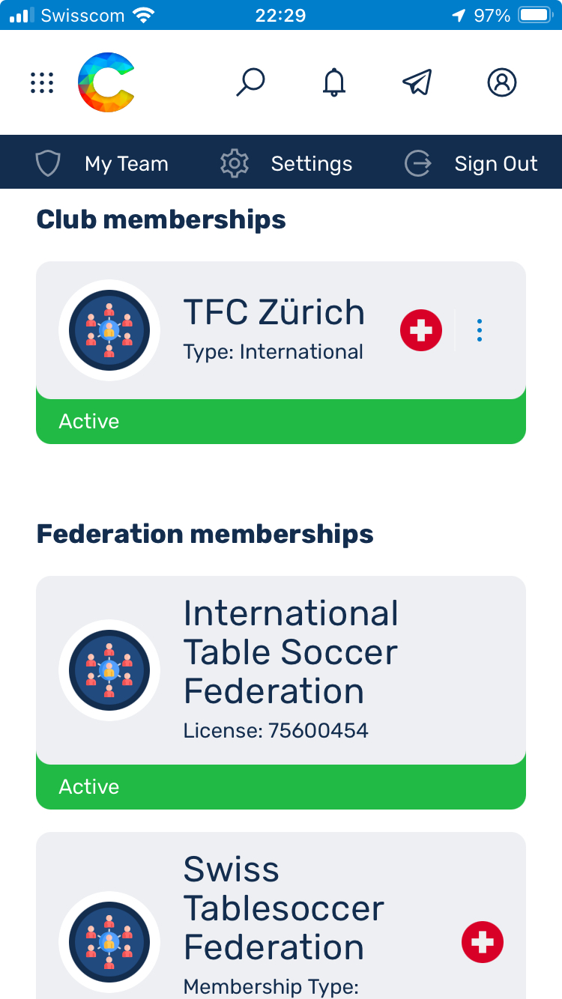{: width="320px" }
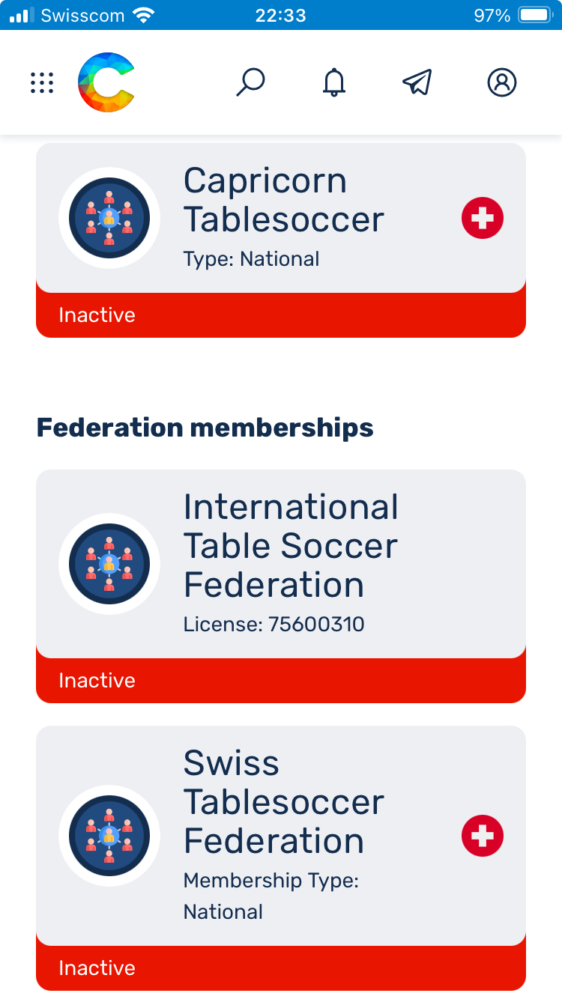{: width="320px" }

## ⁠Unirsi a un club

Per unirti a un club puoi selezionare *Profile > Join Club*. Poi cerca la tua associazione nel campo di ricerca, seleziona il tipo di adesione appropriato e compila le informazioni richieste. Scegli il tipo di adesione secondo i [tipi di licenza dal 2026](licenses/#tipi-di-licenza-dal-2026).

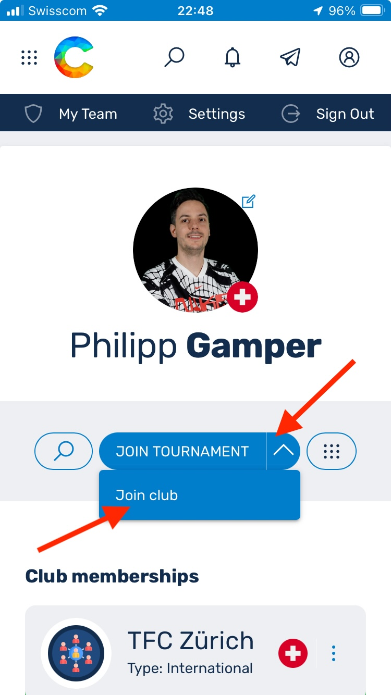{: width="320px" }

## ⁠Durante un torneo
- Inserimento dei risultati
- ⁠Richiami

## ⁠FAQ

### \#1 Non riesco a registrarmi alle competizioni. Le singole discipline sono disabilitate
- Lo stato del giocatore non soddisfa i requisiti. -> Adesione STF (Nazionale o Club) su Active oppure unirsi a un club e scegliere l'adesione "Club"
- L'età non consente la partecipazione alle discipline senior -> Modifica le informazioni del profilo, correggi l'età

### \#1.1 Non riesco a selezionare il/la mio/a partner di gioco durante la registrazione.
Per partecipare alla Swiss Tablesoccer Series (STS) sono ammessi solo i giocatori con stato *Active*. Il/la tuo/a partner di gioco molto probabilmente non è ancora su *Active*. Chiedigli/le di unirsi a un club o di rinnovare l'adesione esistente.

### \#2 Coral mostra solo una schermata bianca sul PC dopo il login
Se un utente vede solo una pagina bianca sul PC dopo il login in Coral, potrebbe essere dovuto al fatto che le sue impostazioni dell'ora non sono corrette. Ovvero l'ora sul suo PC non è sincronizzata (ad es. 3 minuti indietro rispetto all'ora effettiva).
Questo può accadere se la sincronizzazione automatica dell'ora è stata disattivata in Windows. Per rimediare, vai nelle impostazioni dell'ora di Windows e attiva l'impostazione automatica dell'ora e del fuso orario:

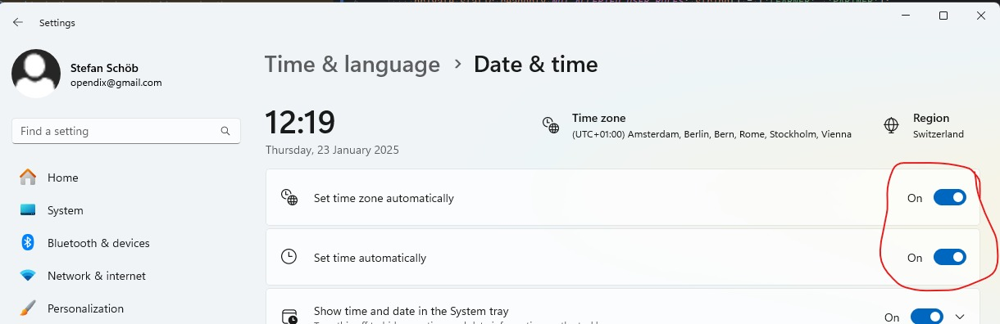{: width="960px" } 

### \#3.1 Come posso installare Coral come Web-App?

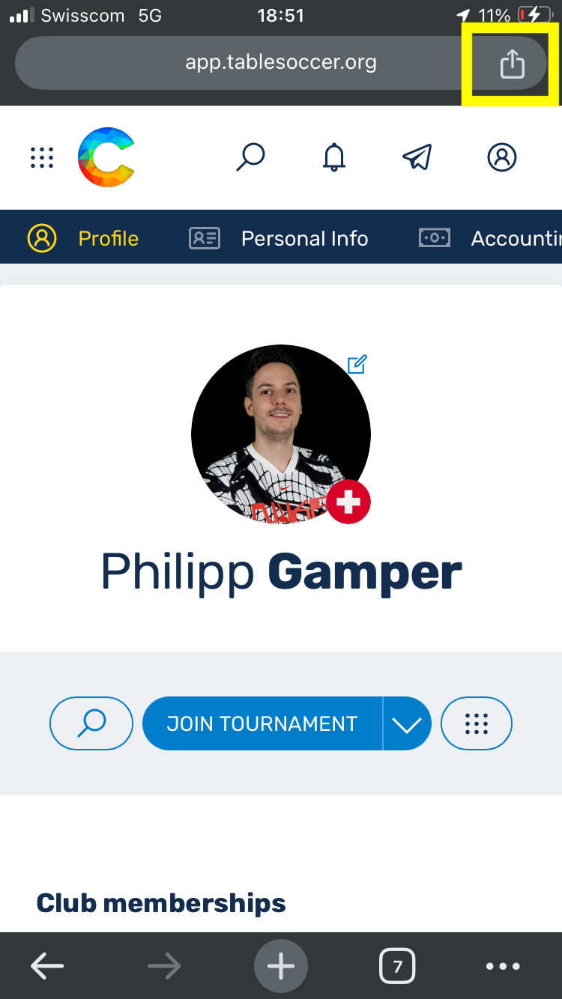{: width="240px" }
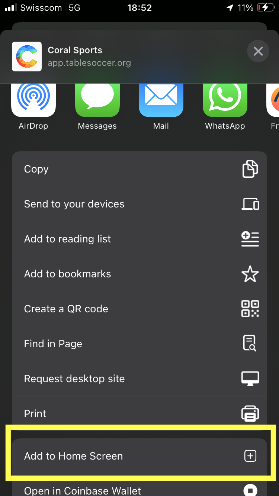{: width="240px" }
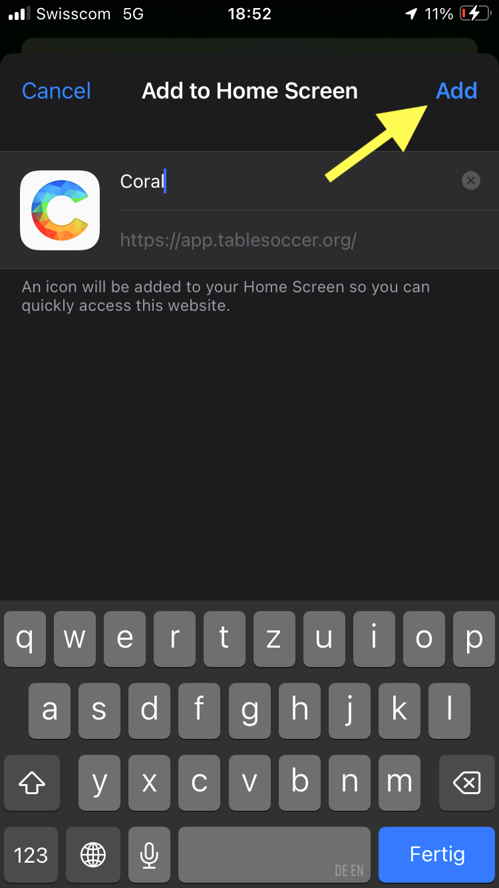{: width="240px" }
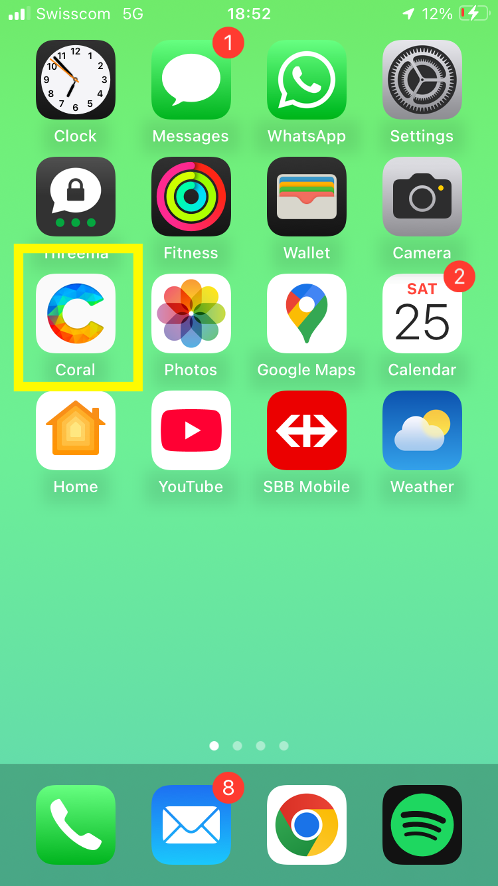{: width="240px" }

### \#3.2 Le notifiche push non funzionano sul mio telefono
Per poter attivare le notifiche push, Coral (app.tablesoccer.org) deve prima essere aggiunto alla schermata home (installazione come Web-App). Vedi _FAQ #3.1_

Le notifiche push devono poi essere attivate in due fasi. Prima sotto *Profile > Settings > Notification*. 

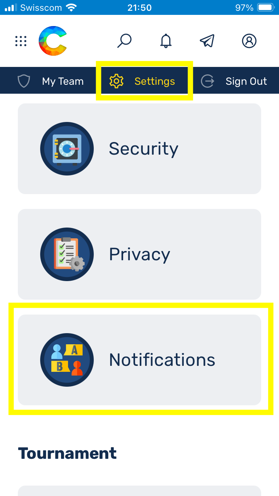{: width="320px" }
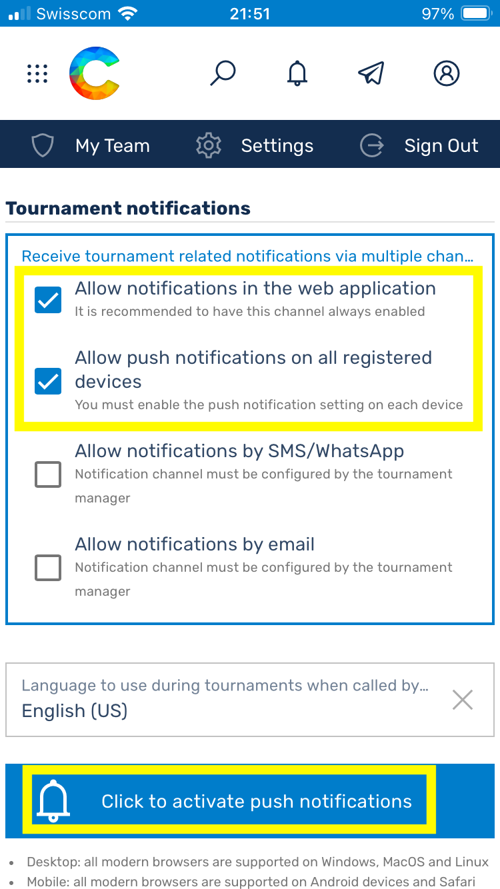{: width="320px" }
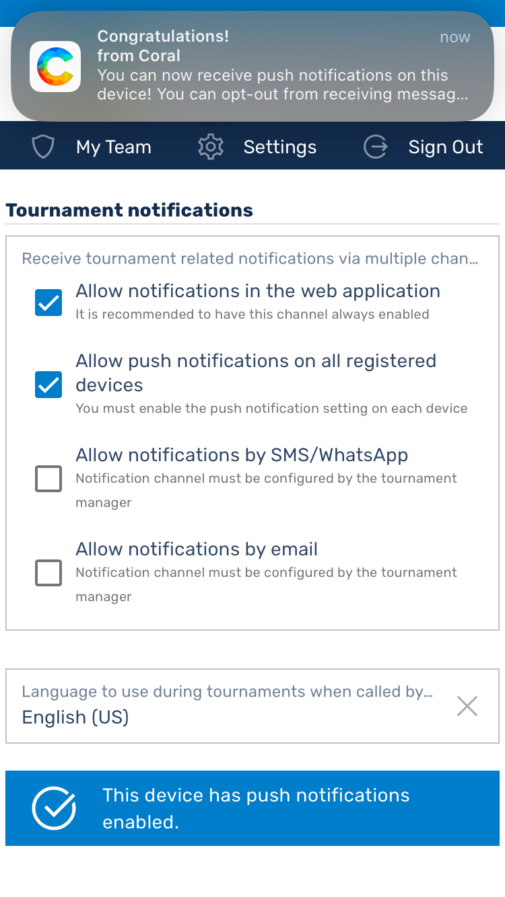{: width="320px" }

Poi sotto il torneo stesso. L'impostazione nel profilo è necessaria affinché Android o iPhone attivi le notifiche push a livello di sistema.
Una volta attivate, le impostazioni del profilo vengono prese come standard per i tornei futuri. Non è quindi necessario riattivarle ogni volta.

### \#4 La tabella non mostra il Buchholz
- Sui dispositivi mobili in modalità verticale la tabella viene visualizzata in forma ridotta: nome del team, piazzamento, punti
- In modalità orizzontale la tabella viene visualizzata completamente. B sta per Buchholz, SB per Small Buchholz resp. Feinbuchholz

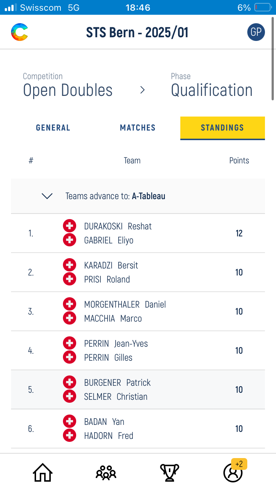{: height="400px"}
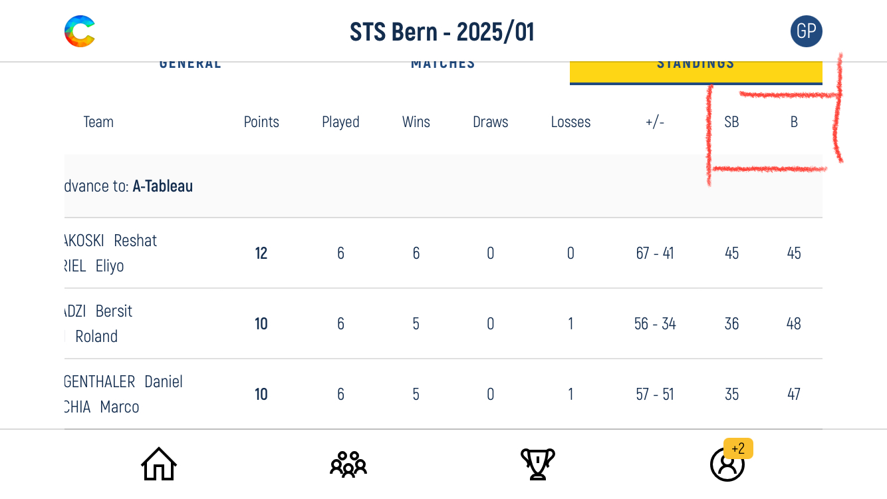{: height="400px"}

### \#5 Mi sono iscritto/a ma il mio stato è ancora su *pending*. Perché?

*Pending* è corretto, metteremo tutti su *Confirmed* il giorno del torneo, non appena avremo effettuato il controllo delle presenze. In questo modo possiamo fare più facilmente delle modifiche in loco se dei giocatori non si presentano o annullano all'ultimo momento. 

### \#6 Come interpretare le quote visualizzate?

Per ora puoi ancora ignorare le quote, è ancora configurato a titolo di prova. È del tutto possibile che queste si discostino ancora dalla realtà. Se vuoi pagare in anticipo, puoi orientarti sulle quote abituali come segue:

- Determinare la classe di forza secondo il [sito web della STF](https://swisstablesoccer.ch/media/attachments/2024/01/16/starkeklassen-2024.pdf). 
    * *__Attenzione!__ La classe di forza non è ancora impostata correttamente in Coral per tutti i giocatori e non è quindi vincolante*
- OD, OS, WD, WS -> CHF 20 (CHF 10 per i Rookie)
- MX, RD -> CHF 10
- CHF 15 per una licenza giornaliera, se non si ha una licenza annuale 

Segui inoltre le istruzioni per il pagamento anticipato secondo il [regolamento del torneo](#7-dove-trovo-ora-il-regolamento-del-torneo). Questo si trova ora anche in Coral.

### \#7 Dove trovo ora il regolamento del torneo?

Il regolamento si trova ora anche in Coral. Sulla pagina iniziale di ogni singolo torneo c'è un link di download dove puoi scaricare e consultare il consueto PDF.

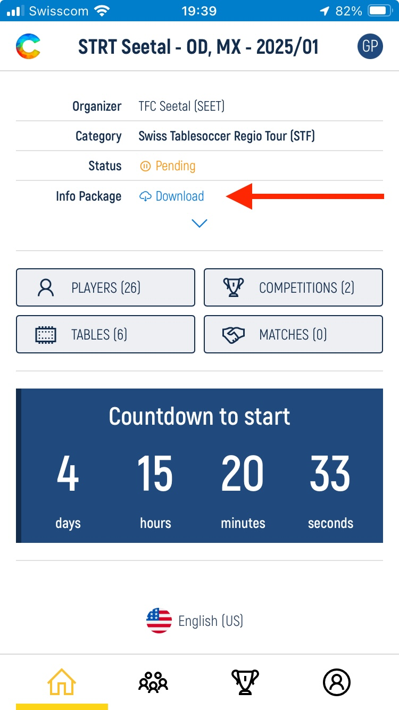{: width="320px" }

### \#8 Wi-Fi ai tornei

Il team di streaming della STF mette a disposizione un Wi-Fi gratuito ai tornei della Swiss Tablesoccer Series (STS), grazie al quale l'interazione con Coral è sufficientemente piacevole anche con una cattiva ricezione in sala. I dati di accesso sono i seguenti:

| Denominazione | Valore |
|:---|:---|
| SSID 2.4 Ghz | STFTurnier |
| Password | STFTurnier! |

_**Avvertenza:** La disponibilità del servizio non è garantita. Possono verificarsi eccezioni a causa di carenze di personale._

### \#9 Quali tipi di licenza esistono in Coral e come si mappano sulle strutture STF conosciute?

|Adesione | Livello | Descrizione | Abilitato per | Costi |
|:---|:---|:---|:---|:---|
| __International - ITSF & STF__ | International | Tutti con licenza annuale ITSF & STF valida | ITSF 250/500/750/1000, STS, STRT, Campionato svizzero | CHF 50 + adesione al club
| __National - STF__ (teorico) | National | Tutti con licenza STF valida senza licenza ITSF | STS senza stato ITSF, STRT, Campionato svizzero | CHF 40 + adesione al club |
| __Club - STF__ | National | Tutti con adesione al club, senza licenza ITSF & STF | STS senza stato ITSF, STRT | Adesione al club |
| __Guest - STF__ | National | Tutti gli altri (né ITSF, STF né adesione al club) | STS senza stato ITSF, STRT | Nessuno |
| __Club - ITSF__ | International | Tutti con adesione al club & licenza ITSF, senza licenza STF | ITSF 250/500/750/1000, STS, STRT | CHF 10 + adesione al club | 
| __Guest - ITSF__ | International | Licenza ITSF, senza licenza STF e senza adesione al club | ITSF 250/500/750/1000, STS, STRT | CHF 10 + spese amministrative | 

_**Avvertenza:** Questo elenco serve attualmente a creare una gestione dei dati utilizzabile in Coral. Come sarà esattamente organizzata la concessione delle licenze per il 2026 deve ancora essere discusso. Sono possibili e probabili aggiustamenti anche in relazione all'arbitraggio._

### \#10 Non soddisfo i requisiti per i tornei ITSF

Per partecipare a un torneo ITSF, in precedenza Pro (250, 500, 750 & 1000) Tour, Master Series, World Series, è necessaria una licenza ITSF. Questa è inclusa nella licenza annuale STF. I giocatori senza licenza annuale STF possono scegliere tramite il proprio club _Club - ITSF_ o _Guest - ITSF_ e acquisire così una licenza ITSF.
