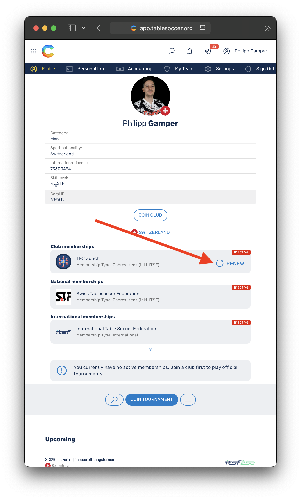
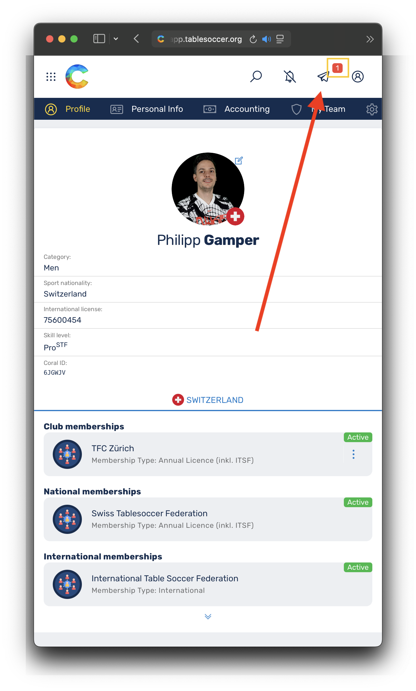
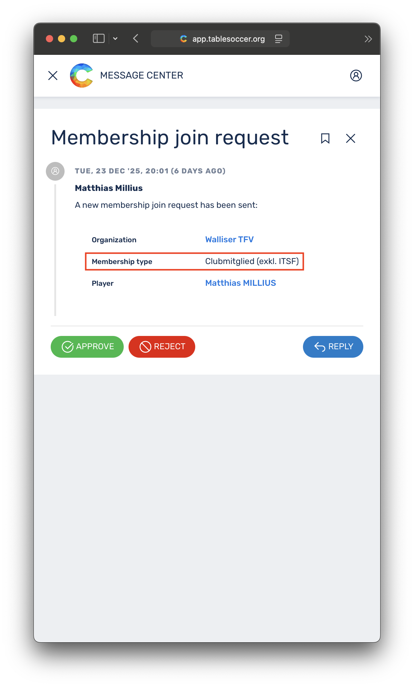
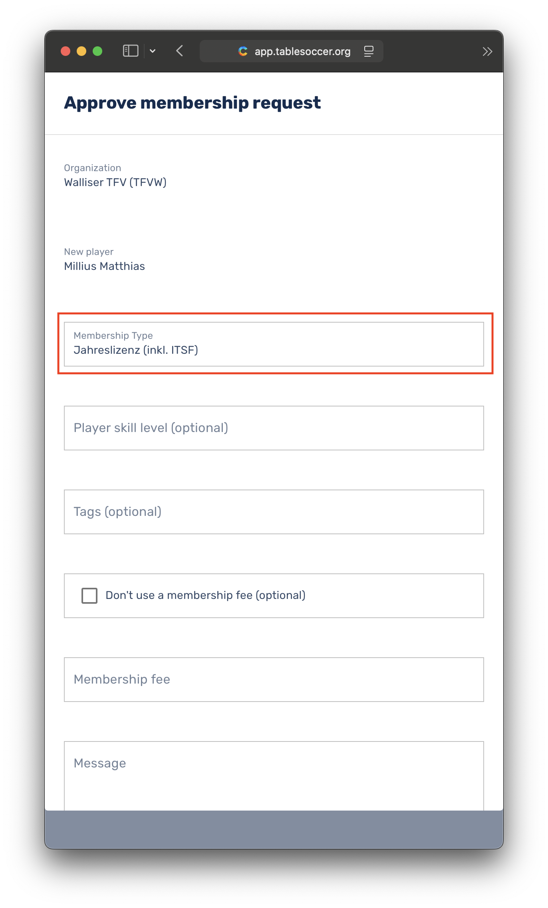
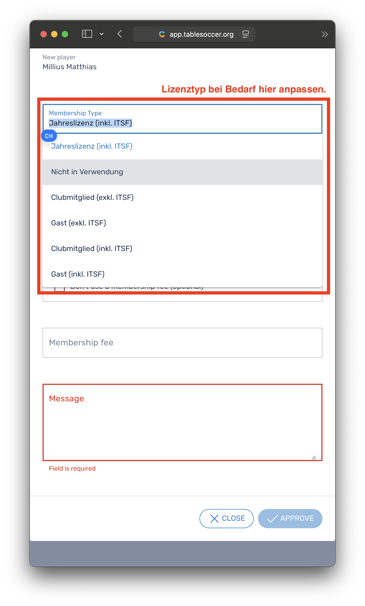
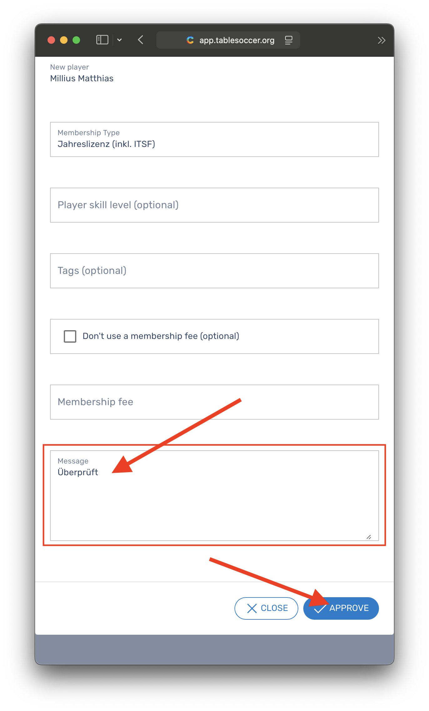

🌐 **Lingua / Sprache / Langue:** [Deutsch](../../de/licenses/) | [Français](../../fr/licenses/) | **Italiano**

---

# Licenze dal 2026 tramite Coral

Sulla base del nuovo [regolamento finanziario](https://static1.squarespace.com/static/6797790a8025010384cf53f2/t/68ffb77095bbce1af05a15ac/1761589104375/2025-10-23-Finanzreglement+Turnier+%26+Lizenzwesen.pdf), a partire dal 2026 verranno introdotti nuovi tipi di licenza e implementati in [Coral](https://app.tablesoccer.org) come descritto di seguito. La licenza decorre dal giorno dell'approvazione fino al 31 dicembre dell'anno in corso e viene automaticamente disattivata al cambio d'anno. I giocatori possono scegliere e richiedere il [tipo di licenza](#tipi-di-licenza-dal-2026) appropriato direttamente in [Coral](https://app.tablesoccer.org). Le spese che ne derivano verranno saldate come in precedenza presso il club di cui si è membri o ospiti (vedi anche [Fatturazione](#fatturazione)). 

## Indice

- [Indice](#indice)
- [Tipi di licenza dal 2026](#tipi-di-licenza-dal-2026)
- [Costi per tipo di licenza](#costi-per-tipo-di-licenza)
- [Richiedere una licenza in Coral](#richiedere-una-licenza-in-coral)
    * [Richiesta da parte dei giocatori](#richiesta-da-parte-dei-giocatori)
    * [Approvazione da parte dei club](#approvazione-da-parte-dei-club)
- [Fatturazione](#fatturazione)
- [Domande frequenti (FAQ)](#faq)
    * [\#1 Le licenze vengono richieste direttamente in Coral?](#1-le-licenze-vengono-richieste-direttamente-in-coral)
    * [\#2 A chi devo pagare le spese di licenza?](#2-a-chi-devo-pagare-le-spese-di-licenza)
    * [\#3 Posso ottenere la licenza annuale anche nel corso dell'anno?](#3-posso-ottenere-la-licenza-annuale-anche-nel-corso-dellanno)
    * [\#4 Posso aggiornare la mia licenza?](#4-posso-aggiornare-la-mia-licenza)
    * [\#5 Quale licenza fa per me?](#5-quale-licenza-fa-per-me)
    * [\#6 Chi può approvare le licenze per il mio club?](#6-chi-può-approvare-le-licenze-per-il-mio-club)
    * [\#7 Panoramica delle licenze](#7-panoramica-delle-licenze-2026)

## Tipi di licenza dal 2026

| Tipo di licenza | Descrizione | Abilitato per | Non abilitato per | 
|:---|:---|:---|:---|
| __Licenza annuale (incl. ITSF)__ *(International)* | Licenza annuale STF, include la licenza ITSF, presente nella classifica STF | __Campionato svizzero__, STS, STRT Pro, STRT, __Tornei ITSF in Svizzera e all'estero__ | Nessuna restrizione | 
| __Membro di club (incl. ITSF)__ *(International)* | Adesione al club, include la licenza ITSF, __nessuna classifica__ | STS, STRT Pro, STRT | __Campionato svizzero__, Tornei ITSF all'__estero__* | 
| __Membro di club (escl. ITSF)__ *(National)* | Adesione al club senza licenza ITSF, __nessuna classifica__ | STRT Pro, STRT | __Campionato svizzero__, Tornei ITSF all'__estero__*, STS | 
| __Ospite (incl. ITSF)__ *(International)* | Sport di massa, include la licenza ITSF, __nessuna classifica__ | STS, STRT Pro, STRT | __Campionato svizzero__, Tornei ITSF all'__estero__* | 
| __Ospite (escl. ITSF)__ *(National)* | Sport di massa *senza licenza*, __nessuna classifica__| STRT Pro, STRT | __Campionato svizzero__, Tornei ITSF all'__estero__*, STS | 

## Costi per tipo di licenza

| Tipo di licenza | Costi licenza | STS | STRT Pro | STRT | ITSF WS | 
|:---|:---|:---:|:---:|:---:|:---:|
| Scadenza | annuale | per partecipazione | per partecipazione | per partecipazione | per partecipazione | 
| __Licenza annuale (incl. ITSF)__ *(International)* | CHF 50 + [Arbitro](https://referee.swisstablesoccer.ch) | Nessuno | Nessuno | Nessuno | Nessuno |
| __Membro di club (incl. ITSF)__ *(International)* | Nessuno* | __CHF 15__ | Nessuno | Nessuno | __CHF 25__ |
| __Membro di club (escl. ITSF)__ *(National)* | Nessuno | N/A | Nessuno | Nessuno | N/A |
| __Ospite (incl. ITSF)__ *(International)* | Nessuno* | __CHF 15__ | Nessuno | Nessuno | __CHF 25__ |
| __Ospite (escl. ITSF)__ *(National)* | Nessuno | N/A | Nessuno | Nessuno | N/A |

__\*__ Per i tornei STS con stato ITSF (250, 500, 750) è necessaria una licenza ITSF *attiva*. I tipi di licenza __*Membro di club (incl. ITSF)*__ e __*Ospite (incl. ITSF)*__ consentono allo sport di massa (giocatori di pub occasionali) un ingresso facilitato nel mondo dei tornei e __non__ costituiscono una licenza ITSF gratuita. In caso di abuso, verranno fatturati CHF 25 conformemente al [regolamento finanziario](https://static1.squarespace.com/static/6797790a8025010384cf53f2/t/68ffb77095bbce1af05a15ac/1761589104375/2025-10-23-Finanzreglement+Turnier+%26+Lizenzwesen.pdf) (3.2.1).

*__Avvertenza:__ I club sono autorizzati a rifiutare gli ospiti o a richiedere una quota amministrativa. La STF non ha alcuna influenza sulla gestione dei singoli club.*

## Richiedere una licenza in Coral

### Richiesta da parte dei giocatori

__Prima richiesta di licenza__ vedi [Unirsi a un club](../#unirsi-a-un-club)

__Rinnovare una licenza__

Le immagini seguenti mostrano come una licenza può essere rinnovata. Nell'esempio viene selezionata la *licenza annuale*. Quale tipo di licenza sia appropriato per chi può essere desunto dalla tabella sopra o dalla [FAQ](#4-posso-aggiornare-la-mia-licenza).

{: width="320px" }
{: width="320px" }
{: width="320px" }

### Approvazione da parte dei club

La STF ha nominato un _responsabile organizzativo_ per ogni club membro. Questi è responsabile del controllo e dell'approvazione delle richieste di licenza. I costi generati dall'approvazione delle licenze richieste verranno fatturati dalla STF al club corrispondente. Il controllo e la riscossione degli importi dovuti sono di responsabilità dei club.

1. Controllo del tipo di licenza scelto. Il tipo di licenza corrisponde alla persona?

    {: width="320px" }
    {: width="320px" }
    {: width="320px" }
    {: width="320px" }

2. In caso di dubbio, informarsi presso la persona e adattare il tipo di licenza prima dell'approvazione. 

    {: width="320px" }

3. _Approvazione_ o _rifiuto_ della richiesta.

    {: width="320px" }

## Fatturazione

Sia per i _responsabili organizzativi_ dei club che per la STF, i costi di licenza che si accumulano sono direttamente visibili in Coral sotto `My Club` > `Accounting`.

Con l'approvazione di una licenza, il club si impegna a sostenere i costi di licenza che ne derivano. La STF fatturerà i costi di licenza accumulati entro la fine dell'anno (eccezioni riservate). Si raccomanda ai club di addebitare i costi di licenza 1:1 per i membri del club e +quota amministrativa per i non membri del club (ospiti).

## ⁠FAQ

### \#1 Le licenze vengono richieste direttamente in Coral?

I giocatori possono scegliere e richiedere il [tipo di licenza](#tipi-di-licenza-dal-2026) appropriato direttamente in [Coral](https://app.tablesoccer.org).

### \#2 A chi devo pagare le spese di licenza?

Le spese che si accumulano vengono saldate come in precedenza presso il club di cui si è membri o ospiti (vedi anche [Fatturazione](#fatturazione)). 

### \#3 Posso ottenere la licenza annuale anche nel corso dell'anno?

Sì, è possibile ottenere la licenza annuale anche nel corso dell'anno. La licenza decorre dal giorno dell'approvazione fino al 31 dicembre dell'anno in corso e viene automaticamente disattivata al cambio d'anno.

### \#4 Posso aggiornare la mia licenza?

Sì, è possibile aggiornare la propria licenza nel corso dell'anno. Ciò comporta le spese complete della licenza verso cui si effettua l'aggiornamento. __Le spese già addebitate e/o pagate, ad es. la quota di torneo (ex licenza giornaliera), non vengono accreditate.__

### \#5 Quale licenza fa per me?

- Scegli *__Licenza annuale (incl. ITSF)__* se ...
    - ... partecipi regolarmente alle STS
    - ... partecipi regolarmente alla Regio-Tour (STRT & STRT Pro)
    - ... vuoi qualificarti per il __Campionato svizzero__
    - ... vuoi giocare __tornei ITSF all'estero__. 
    - ... vuoi essere __classificato/a nella classifica STF__ 
    - ... sei un giocatore di tornei / sportivo agonista 
    - ... vuoi mantenere il carico amministrativo per la STF il più basso possibile

- Scegli *__Membro di club (incl. ITSF)__* se ...
    - ... partecipi al massimo a 1-2 STS all'anno 
    - ... partecipi regolarmente alla Regio-Tour (STRT & STRT Pro)
    - ... __non__ vuoi partecipare al Campionato svizzero
    - ... __non__ vuoi giocare tornei ITSF all'estero
    - ... __non__ vuoi essere classificato/a nella classifica STF
    - ... ti consideri uno sportivo di massa (giocatore di pub)

- Scegli *__Membro di club (escl. ITSF)__* se ...
    - ... partecipi __solo__ regolarmente alla Regio-Tour (STRT & STRT Pro)
    - ... __non__ vuoi partecipare al Campionato svizzero
    - ... __non__ vuoi giocare tornei ITSF all'estero
    - ... __non__ vuoi essere classificato/a nella classifica STF
    - ... ti consideri uno sportivo di massa (giocatore di pub)

- Scegli *__Ospite (incl. ITSF)__* se ...
    - ... __non__ sei un membro attivo di un club membro STF
    - ... partecipi al massimo a 1-2 STS all'anno 
    - ... partecipi regolarmente alla Regio-Tour (STRT & STRT Pro)
    - ... __non__ vuoi partecipare al Campionato svizzero
    - ... __non__ vuoi giocare tornei ITSF all'estero
    - ... __non__ vuoi essere classificato/a nella classifica STF
    - ... ti consideri uno sportivo di massa (giocatore di pub)

- Scegli *__Ospite (escl. ITSF)__* se ...
    - ... __non__ sei un membro attivo di un club membro STF
    - ... partecipi __solo__ regolarmente alla Regio-Tour (STRT & STRT Pro)
    - ... __non__ vuoi partecipare al Campionato svizzero
    - ... __non__ vuoi giocare tornei ITSF all'estero
    - ... __non__ vuoi essere classificato/a nella classifica STF
    - ... ti consideri uno sportivo di massa (giocatore di pub)

### \#6 Chi può approvare le licenze per il mio club?

La tabella seguente indica le persone per club che sono responsabili dell'approvazione e sono state istruite sul processo.

| Club | Responsabile dell'approvazione |
|:---|:---|
| Associazione Table-Soccer Ticino (ATST) | David Baldasari |
| Bern Ballers | Mike Schrepfer |
| CFT Jura Seeland | Cyrill Amez |
| CFT Saloon Acacias | *Michel Burgener* |
| CFT du Chablais | Tristan Devaud |
| Capricorn Tablesoccer | Claudio Salzgeber |
| Foosballeur | Egon Kuonen |
| Fordere.ch Zürich | Philipp Gamper |
| TFC Bern | Sandra Gäumann |
| TFC Freiburg Sense | Christoph Burri |
| TFC Laupen | Stephan Frieden |
| TFC Luzern | Manuel Ragonesi |
| TFC Seetal | Peter Brogli |
| TFC Simmental | Oliver Mani |
| TFC St. Gallen | Steven Imhof |
| TFC Thayngen | *TBD* |
| TFC Thun | Paul Beyeler |
| TFC Zürich | Christoph Zimmermann |
| TFK Rüti | Thomas Maurer | 
| TFV Gams | N/A |
| TSS Goldach | Dusan Pekic & Hermann Fritsche |
| Tablesoccer b. Basel | Antonio Carruso & Nicole Weber |
| Töggeli Graben Bern | Marcos Peixoto |
| Wallisser Tischfussballverein | Michel Regotz |

### \#7 *Panoramica* delle licenze 2026

| Tipo di licenza | Descrizione | Abilitato per | Non abilitato per | Costi (annuali) | STS | STRT (Pro) | ITSF WS | 
|:---|:---|:---|:---|:---|:---:|:---:|:---:|
| __Licenza annuale (incl. ITSF)__ *(International)* | Licenza annuale STF, include la licenza ITSF, presente nella classifica STF | __Campionato svizzero__, STS, STRT Pro, STRT, __Tornei ITSF in Svizzera e all'estero__ | Nessuna restrizione | CHF 50 + Arbitro | Nessuno | Nessuno | Nessuno |
| __Membro di club (incl. ITSF)__ *(International)* | Adesione al club, include la licenza ITSF, __nessuna classifica__ | STS, STRT Pro, STRT | __Campionato svizzero__, Tornei ITSF all'__estero__* | Nessuno* | __CHF 15__ | Nessuno | __CHF 25__ |
| __Membro di club (escl. ITSF)__ *(National)* | Adesione al club senza licenza ITSF, __nessuna classifica__ | STRT Pro, STRT | __Campionato svizzero__, Tornei ITSF all'__estero__*, STS | Nessuno | N/A | Nessuno | N/A |
| __Ospite (incl. ITSF)__ *(International)* | Sport di massa, include la licenza ITSF, __nessuna classifica__ | STS, STRT Pro, STRT | __Campionato svizzero__, Tornei ITSF all'__estero__* | Nessuno* | __CHF 15__ | Nessuno | __CHF 25__ |
| __Ospite (escl. ITSF)__ *(National)* | Sport di massa *senza licenza*, __nessuna classifica__| STRT Pro, STRT | __Campionato svizzero__, Tornei ITSF all'__estero__*, STS | Nessuno | N/A | Nessuno | N/A |

__\*__ Per i tornei STS con stato ITSF (250, 500, 750) è necessaria una licenza ITSF *attiva*. I tipi di licenza __*Membro di club (incl. ITSF)*__ e __*Ospite (incl. ITSF)*__ consentono allo sport di massa (giocatori di pub occasionali) un ingresso facilitato nel mondo dei tornei e __non__ costituiscono una licenza ITSF gratuita. In caso di abuso, verranno fatturati CHF 25 conformemente al [regolamento finanziario](https://static1.squarespace.com/static/6797790a8025010384cf53f2/t/68ffb77095bbce1af05a15ac/1761589104375/2025-10-23-Finanzreglement+Turnier+%26+Lizenzwesen.pdf) (3.2.1).
