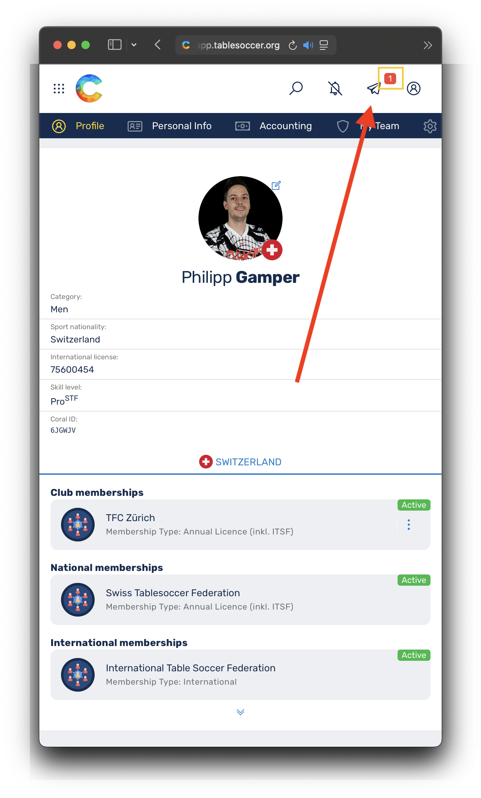
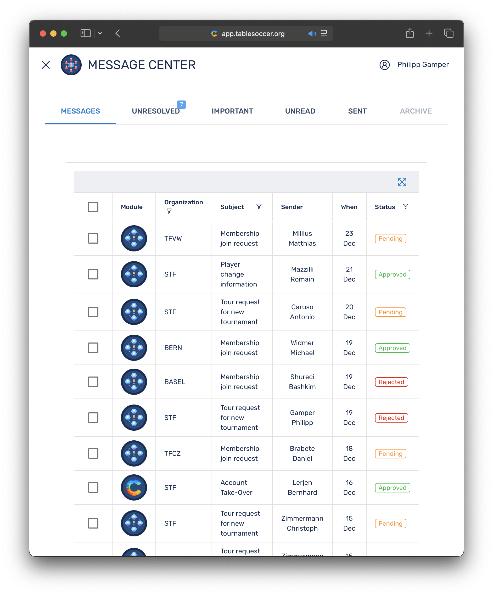
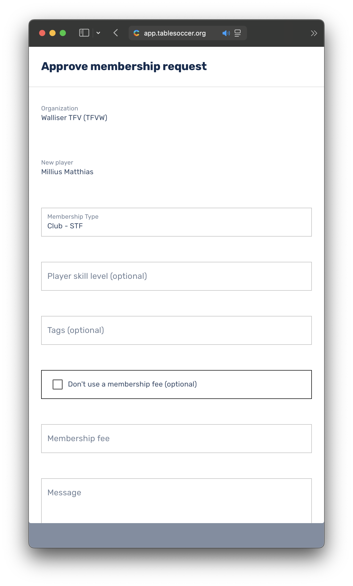
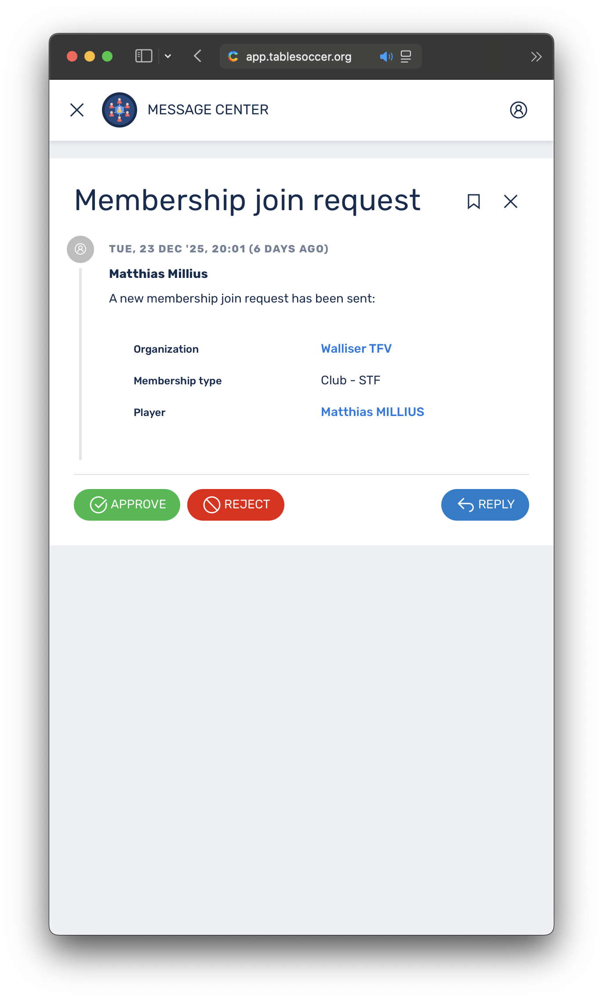
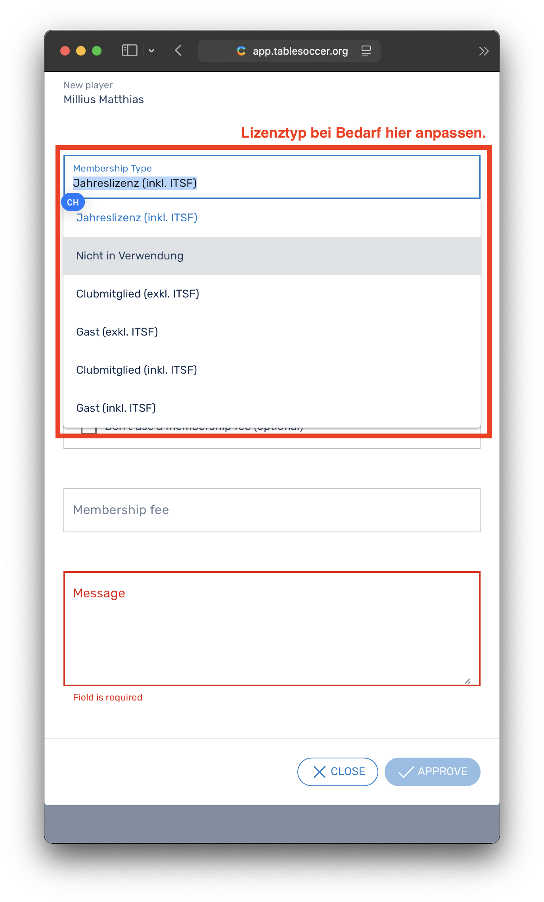
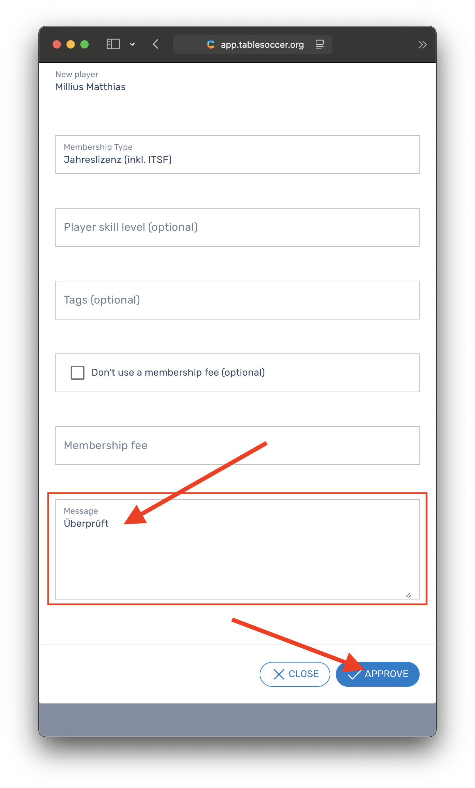

# Lizenzierung ab 2026 über Coral

Basierend auf dem neuen [Finanzreglement](https://static1.squarespace.com/static/6797790a8025010384cf53f2/t/68ffb77095bbce1af05a15ac/1761589104375/2025-10-23-Finanzreglement+Turnier+%26+Lizenzwesen.pdf) werden ab 2026 neue Lizenztypen eingeführt und wie nachfolgend beschrieben in [Coral](https://app.tablesoccer.ch) abgebildet. Die Lizenzierung läuft jeweils ab dem Tag der Freigabe bis zum 31. Dezember des laufenden Jahres und werden automatisch zum Jahreswechsel inaktiviert. Spielenden können den passenden [Lizenztypen](https://register.swisstablesoccer.ch/licenses#lizenztypen-ab-2026) direkt in [Coral](https://app.tablesoccer.ch) selber wählen und beantragen. Die dadurch anfallenden Gebühren werden wie bisher beim jenem Verein begleichen, welchem man als Mitglied oder Gast angehört (siehe auch [Abrechnung](https://register.swisstablesoccer.ch/#abrechnung)). 

## Inhaltsverzeichnis

- [Inhaltsverzeichnis](https://register.swisstablesoccer.ch/licenses#inhaltsverzeichnis)
- [Lizenztypen ab 2026](https://register.swisstablesoccer.ch/licenses#lizenztypen-ab-2026)
- [Kosten je Lizenztyp](https://register.swisstablesoccer.ch/licenses/#kosten-je-lizenztyp)
- [Lizenz in Coral beantragen](https://register.swisstablesoccer.ch/licenses/#lizenz-in-coral-beantragen)
    * [Beantragen durch Spielende](https://register.swisstablesoccer.ch/licenses/#beantragen-durch-spielende)
    * [Freigabe durch Vereine](https://register.swisstablesoccer.ch/licenses/#freigabe-durch-vereine)
- [Abrechnung](https://register.swisstablesoccer.ch/licenses#abrechnung)
- [Häufig gestellte Fragen (FAQ)](https://register.swisstablesoccer.ch/licenses#faq)
    * [\#1 Werden Lizenzen direkt in Coral beantragt?](https://register.swisstablesoccer.ch/licenses#1-werden-lizenzen-direkt-in-coral-beantragt)
    * [\#2 An wen muss ich Lizenzkosten bezahlen?](https://register.swisstablesoccer.ch/licenses/#2-an-wen-muss-ich-lizenzkosten-bezahlen)
    * [\#3 Kann ich die Jahreslizenz auch unter dem Jahr lösen?](https://register.swisstablesoccer.ch/licenses/#3-kann-ich-die-jahreslizenz-auch-unter-dem-jahr-lösen)
    * [\#4 Kann ich meine Lizenz upgraden?](https://register.swisstablesoccer.ch/licenses/#4-kann-ich-meine-lizenz-upgraden)
    * [\#5 Welche Lizenz passt zu mir?](https://register.swisstablesoccer.ch/licenses/#5-welche-lizenz-passt-zu-mir)
    * [\#6 Wer kann für meinen Verein Lizenzen freigeben?](https://register.swisstablesoccer.ch/licenses/#6-wer-kann-für-meinen-verein-lizenzen-freigeben)
    * [\#7 Big Picture Lizenzierung](https://register.swisstablesoccer.ch/licenses/#7-big-picture-lizenzierung-2026)

## Lizenztypen ab 2026

| Lizenztyp | Beschreibung | Teilnahmebrechtigt für | Nicht berechtigt für| 
|:---|:---|:---|:---|
| __Jahreslizenz (inkl. ITSF)__ *(International)* | STF Jahreslizenz, enthält ITSF-Lizenz, gelistet in STF-Rangliste | __CH-Meisterschaft__, STS, STRT Pro, STRT, __ITSF-Turniere im In- & Ausland__ | Keine Einschränkung | 
| __Clubmitglied (inkl. ITSF)__ *(International)* | Clubmitgliedschaft, enthält ITSF-Lizenz, __keine Rangierung__ | STS, STRT Pro, STRT | __CH-Meisterschaft__, ITSF-Turniere im __Ausland__* | 
| __Clubmitglied (exkl. ITSF)__ *(National)* | Clubmitgliedschaft ohne ITSF-Lizenz, __keine Rangierung__ | STRT Pro, STRT | __CH-Meisterschaft__, ITSF-Turniere im __Ausland__*, STS | 
| __Gast (inkl. ITSF)__ *(International)* | Breitensport, enthält ITSF-Lizenz, __keine Rangierung__ | STS, STRT Pro, STRT | __CH-Meisterschaft__, ITSF-Turniere im __Ausland__* | 
| __Gast (exkl. ITSF)__ *(National)* | Breitensport *ohne Lizenzierung*, __keine Rangierung__| STRT Pro, STRT | __CH-Meisterschaft__, ITSF-Turniere im __Ausland__*, STS | 

## Kosten je Lizenztyp

| Lizenztyp | Lizenzkosten | STS | STRT Pro | STRT | ITSF WS | 
|:---|:---|:---:|:---:|:---:|:---:|
| Fälligkeit | jährlich | je Teilnahme | je Teilnahme | je Teilnahme | je Teilnahme | 
| __Jahreslizenz (inkl. ITSF)__ *(International)* | CHF 50 + [Referee](https://referee.swisstablesoccer.ch) | Keine | Keine | Keine | Keine |
| __Clubmitglied (inkl. ITSF)__ *(International)* | Keine* | __CHF 15__ | Keine | Keine | __CHF 25__ |
| __Clubmitglied (exkl. ITSF)__ *(National)* | Keine | N/A | Keine | Keine | N/A |
| __Gast (inkl. ITSF)__ *(International)* | Keine* | __CHF 15__ | Keine | Keine | __CHF 25__ |
| __Gast (exkl. ITSF)__ *(National)* | Keine | N/A | Keine | Keine | N/A |

__\*__ Für STS-Turniere mit ITSF-Status (250, 500, 750) ist eine *aktive* ITSF-Lizenz notwendig. Die Lizenztypen __*Clubmitglied (inkl. ITSF)*__ und __*Gast (inkl. ITSF)*__ erlauben dem Breitensport (gelegenheits Pub-Spieler) einen erleichterten Einstieg in die Turnierwelt und __keine__ kostenlose ITSF-Lizenz. Bei Missbrauch werden gemäss [Finanzreglement](https://static1.squarespace.com/static/6797790a8025010384cf53f2/t/68ffb77095bbce1af05a15ac/1761589104375/2025-10-23-Finanzreglement+Turnier+%26+Lizenzwesen.pdf) (3.2.1) CHF 25 in Rechnung gestellt.

*__Disclaimer:__ Vereine dürfen Gäste ablehnen oder aber eine Administrationsgebühr verlangen. Die STF hat keinen Einfluss auf die Handhabung der einzelnen Vereine.*

## Lizenz in Coral beantragen

### Beantragen durch Spielende

__Erstmaliges beantragen einer Lizenz__ siehe [Einem Club beitreten](https://register.swisstablesoccer.ch/#einem-club-beitreten)

__Erneuern einer Lizenz__

*Bild kommt ab dem 1.1.2026*

### Freigabe durch Vereine

Die STF hat für jeden Mitgliederverein einen _Organisationsmanager_ ernannt. Dieser ist für die Kontrolle und Freigabe von Lizenzanfragen zuständig. Durch die Freigabe von beantragten Lizenzen anfallende Kosten werden von der STF dem entsprechenden Verein in Rechnung gestellt. Die Kontrolle und das Einfordern ausstehender Beträge liegt in der Verantwortung der Vereine.

1. Kontrolle des gewählten Lizenztyps. Passt der Lizenztyp zur Person?

    {: width="320px" }
    {: width="320px" }
    {: width="320px" }
    {: width="320px" }

2. Im Zweifelsfall bei der Person nachfragen und den Lizenztyp vor der Freigabe Anpassen. 

    {: width="320px" }

3. _Freigabe_ oder _Ablehnung_ der Anfrage.

    {: width="320px" }

## Abrechnung

Sowohl für _Organisationsmanager_ von Vereine als auch für die STF sind anfallende Lizenzkosten in Coral direkt ersichtlich unter `My Club` > `Accounting` ersichtlich.

Mit der Freigabe einer Lizenz, verpflichtet sich der Verein, entstehende Lizenzkosten zu tragen. Die STF wird angesamelte Lizenzkosten bis spätestens zum Jahresende in Rechnung stellen (Ausnahmen vorbehalten). Den Vereinen wird empfohlen die Lizenzkosten 1:1 für Vereinsmitglieder und +Admingebühr für Nicht-Vereinsmitglieder (Gäste) weiterzuverrechnen.

## ⁠FAQ

### \#1 Werden Lizenzen direkt in Coral beantragt?

Spielenden könnn den passenden [Lizenztypen](https://register.swisstablesoccer.ch/licenses#lizenztypen-ab-2026) direkt in [Coral](https://app.tablesoccer.ch) selber wählen und beantragen.

### \#2 An wen muss ich Lizenzkosten bezahlen?

Anfallenden Gebühren werden wie bisher beim jenem Verein begleichen, welchem man als Mitglied oder Gast angehört (siehe auch [Abrechnung](https://register.swisstablesoccer.ch/licenses#abrechnung)). 

### \#3 Kann ich die Jahreslizenz auch unter dem Jahr lösen?

Ja, es ist möglich die Jahreslizenz auch unter dem Jahr zu lösen. Die Lizenzierung läuft jeweils ab dem Tag der Freigabe bis zum 31. Dezember des laufenden Jahres und werden automatisch zum Jahreswechsel inaktiviert.

### \#4 Kann ich meine Lizenz upgraden?

Ja, es ist möglich unter dem Jahr seine Lizenz aufzustufen. Dadurch fallen die vollen Gebühren jener Lizenz an, auf welche aufgestuft wird. __Bereits anfallende und/oder bezahlte Gebühren, bspw. Turniergebühr (ehem. Tageslizenz) werden nicht angerechnet.__

### \#5 Welche Lizenz passt zu mir?

- Wähle *__Jahreslizenz (inkl. ITSF)__*  wenn Du ...
    - ... regelmässig an STS teilnimmst
    - ... regelmäss an der Regio-Tour teilnimmst (STRT & STRT Pro)
    - ... dich für die __CH-Meisterschaft__ qualifizieren willst
    - ... __ITSF-Turniere im Ausland__ spielen wilst. 
    - ... in der __STF-Rangliste__ gelistet sein willst 
    - ... Turnierspieler / Leistungssportler bist 
    - ... den Administrationsaufwand für die STF möglichst gering halten möchtest

- Wähle *__Clubmitglied (inkl. ITSF)__*  wenn Du ...
    - ... an maximal 1-2 STS pro Jahr teilnimmst 
    - ... regelmäss an der Regio-Tour teilnimmst (STRT & STRT Pro)
    - ... __nicht__ an der CH-Meisterschaft teilnehmen willst
    - ... __keine__ ITSF-Turniere im Ausland spielen willst
    - ... __nicht__ in der STF-Rangliste geführt werden willst
    - ... dich zum Breitensport (Pub-Spieler) zählst

- Wähle *__Clubmitglied (exkl. ITSF)__*  wenn Du ...
    - ... einfach __nur__ regelmäss an der Regio-Tour teilnimmst (STRT & STRT Pro)
    - ... __nicht__ an der CH-Meisterschaft teilnehmen willst
    - ... __keine__ ITSF-Turniere im Ausland spielen willst
    - ... __nicht__ in der STF-Rangliste geführt werden willst
    - ... dich zum Breitensport (Pub-Spieler) zählst

- Wähle *__Gast (inkl. ITSF)__*  wenn Du ...
    - ... __kein__ aktives Clubmitglied eines STF-Mitgliedervereins bist
    - ... an maximal 1-2 STS pro Jahr teilnimmst 
    - ... regelmäss an der Regio-Tour teilnimmst (STRT & STRT Pro)
    - ... __nicht__ an der CH-Meisterschaft teilnehmen willst
    - ... __keine__ ITSF-Turniere im Ausland spielen willst
    - ... __nicht__ in der STF-Rangliste geführt werden willst
    - ... dich zum Breitensport (Pub-Spieler) zählst

- Wähle *__Gast (exkl. ITSF)__*  wenn Du ...
    - ... __kein__ aktives Clubmitglied eines STF-Mitgliedervereins bist
    - ... einfach __nur__ regelmäss an der Regio-Tour teilnimmst (STRT & STRT Pro)
    - ... __nicht__ an der CH-Meisterschaft teilnehmen willst
    - ... __keine__ ITSF-Turniere im Ausland spielen willst
    - ... __nicht__ in der STF-Rangliste geführt werden willst
    - ... dich zum Breitensport (Pub-Spieler) zählst

### \#6 Wer kann für meinen Verein Lizenzen freigeben?

Die nachfolgende Tabelle zeigt Personen je Verein, welche für die Freigabe zuständig und über den Prozess instruiert worden sind.

| Verein | Für die Freigabe zuständig |
|:---|:---|
| Associazione Table-Soccer Ticino (ATST) | David Baldasari |
| Bern Ballers | Mike Schrepfer |
| CFT Jura Seeland | Cyrill Amez |
| CFT Saloon Acacias | *Michel Burgener* |
| CFT du Chablais | Tristan Devaud |
| Capricorn Tablesoccer | Claudio Salzgeber |
| Foosballeur | Egon Kuonen |
| Fordere.ch Zürich | Philipp Gamper |
| TFC Bern | Sandra Gäumann |
| TFC Freiburg Sense | Christoph Burri |
| TFC Laupen | Stephan Frieden |
| TFC Luzern | Manuel Ragonesi |
| TFC Seetal | Peter Brogli |
| TFC Simmental | Oliver Mani |
| TFC St. Gallen | Steven Imhof |
| TFC Thayngen | *TBD* |
| TFC Thun | Paul Beyeler |
| TFC Zürich | Christoph Zimmermann |
| TFK Rüti | Thomas Maurer | 
| TFV Gams | N/A |
| TSS Goldach | Dusan Pekic & Hermann Fritsche |
| Tablesoccer b. Basel | Antonio Carruso & Nicole Weber |
| Töggeli Graben Bern | Marcos Peixoto |
| Wallisser Tischfussballverein | Michel Regotz |

### \#7 *Big Picture* Lizenzierung 2026

| Lizenztyp | Beschreibung | Teilnahmebrechtigt für | Nicht berechtigt für| Kosten (jährlich) | STS | STRT (Pro) | ITSF WS | 
|:---|:---|:---|:---|:---|:---:|:---:|:---:|
| __Jahreslizenz (inkl. ITSF)__ *(International)* | STF Jahreslizenz, enthält ITSF-Lizenz, gelistet in STF-Rangliste | __CH-Meisterschaft__, STS, STRT Pro, STRT, __ITSF-Turniere im In- & Ausland__ | Keine Einschränkung | CHF 50 + Referee | Keine | Keine | Keine |
| __Clubmitglied (inkl. ITSF)__ *(International)* | Clubmitgliedschaft, enthält ITSF-Lizenz, __keine Rangierung__ | STS, STRT Pro, STRT | __CH-Meisterschaft__, ITSF-Turniere im __Ausland__* | Keine* | __CHF 15__ | Keine | __CHF 25__ |
| __Clubmitglied (exkl. ITSF)__ *(National)* | Clubmitgliedschaft ohne ITSF-Lizenz, __keine Rangierung__ | STRT Pro, STRT | __CH-Meisterschaft__, ITSF-Turniere im __Ausland__*, STS | Keine | N/A | Keine | N/A |
| __Gast (inkl. ITSF)__ *(International)* | Breitensport, enthält ITSF-Lizenz, __keine Rangierung__ | STS, STRT Pro, STRT | __CH-Meisterschaft__, ITSF-Turniere im __Ausland__* | Keine* | __CHF 15__ | Keine | __CHF 25__ |
| __Gast (exkl. ITSF)__ *(National)* | Breitensport *ohne Lizenzierung*, __keine Rangierung__| STRT Pro, STRT | __CH-Meisterschaft__, ITSF-Turniere im __Ausland__*, STS |  Keine | N/A | Keine | N/A |

__\*__ Für STS-Turniere mit ITSF-Status (250, 500, 750) ist eine *aktive* ITSF-Lizenz notwendig. Die Lizenztypen __*Clubmitglied (inkl. ITSF)*__ und __*Gast (inkl. ITSF)*__ erlauben dem Breitensport (gelegenheits Pub-Spieler) einen erleichterten Einstieg in die Turnierwelt und __keine__ kostenlose ITSF-Lizenz. Bei Missbrauch werden gemäss [Finanzreglement](https://static1.squarespace.com/static/6797790a8025010384cf53f2/t/68ffb77095bbce1af05a15ac/1761589104375/2025-10-23-Finanzreglement+Turnier+%26+Lizenzwesen.pdf) (3.2.1) CHF 25 in Rechnung gestellt.